# <center>COURSE PROJECT</center>

<p align="center">
    <strong>Universidad Peruana de Ciencias Aplicadas</strong><br>
    </img><br>
    <strong>Ingeniería de Software</strong><br>
    <strong>Curso: Desarrollo de Soluciones IOT</strong><br>
    <strong>Profesor: Leon Baca, Marco Antonio </strong><br>
    <br>INFORME TRABAJO FINAL
</p>
<center>

#### Startup: **Momentum**
#### Product: **PumpUp**
</center>

### <center>Team  Members:</center>
<center>

| Codigo                           | Miembro       |
|----------------------------------|------------|
|  U202211212 | Del Castillo Bueno, Daniel Mateo |
|  U202015274 | Sanchez Montero, Carlos |
|  U202213384 | Pinto Fuentes Rivera, Alvaro Felipe  |
|  U20211G163 | Solis Solis, Leonardo José |
|  U20221c138 | Poma Espinoza, Gustavo Arturo |


<br> AGOSTO 2025
</center>  

<div style="page-break-after: always;"></div>

# Registro de Versiones del Informe
<center>

| Version | Fecha | Autor | Descripcion de Modificacion |
| ----------- | ----------- | ----------- | ----------- |
| 0.0 | 01/09/2025 |Grupo 1 |Se crea el documento |  
| 0.1 | 10/09/2025 |Grupo 1 |Se termina el capitulo I |  
| 0.2 | 15/09/2025 |Grupo 1 |Se termina el capitulo II Y III |  
| 0.3 | 20/09/2025 |Grupo 1 |Se termina el capitulo IV |  

</center>

# Project Report Collaboration Insights
[URL del repositorio](https://github.com/momentum-iot/report)

TB1:

TP:


# Contenido


[Registro de Versiones del Informe](#registro-de-versiones-del-informe)

[Project Report Collaboration Insights](#project-report-collaboration-insights)

[Student Outcome](#student-outcome)

[Capítulo I: Introducción](#capítulo-i-introducción)

[1.1 Startup Profile](#11-startup-profile)  
[1.1.1. Descripción de la Startup](#111-descripción-de-la-startup)  
[1.1.2. Perfiles de integrantes del equipo](#112-perfiles-de-integrantes-del-equipo)  

[1.2. Solution Profile](#12-solution-profile)  
[1.2.1 Antecedentes y problemática](#121-antecedentes-y-problemática)  
[1.2.2 Lean UX Process.](#122-lean-ux-process)  
[1.2.2.1. Lean UX Problem Statements.](#1221-lean-ux-problem-statements)  
[1.2.2.2. Lean UX Assumptions.](#1222-lean-ux-assumptions)  
[1.2.2.3. Lean UX Hypothesis Statements.](#1223-lean-ux-hypothesis-statements)  
[1.2.2.4. Lean UX Canvas.](#1224-lean-ux-canvas)  

[1.3. Segmentos objetivo.](#13-segmentos-objetivo)  

[Capítulo II: Requirements Elicitation & Analysis](#capítulo-ii-requirements-elicitation--analysis)  

[2.1. Competidores](#21-competidores)  
[2.1.1. Análisis competitivo](#211-análisis-competitivo)  
[2.1.2. Estrategias y tácticas frente a competidores](#211-análisis-competitivo)  

[2.2. Entrevistas](#22-entrevistas)  
[2.2.1. Diseño de entrevistas](#221-diseño-de-entrevistas)  
[2.2.2. Registro de entrevistas](#222-registro-de-entrevistas)  
[2.2.3. Análisis de entrevistas](#223-análisis-de-entrevistas)  

[2.3. Needfinding](#23-needfinding)  
[2.3.1. User Personas](#231-user-personas)  
[2.3.2. User Task Matrix](#232-user-task-matrix)  
[2.3.3. User Journey Mapping](#233-user-journey-mapping)  
[2.3.4. Empathy Mapping](#234-empathy-mapping)  
[2.3.5. As-is Scenario Mapping](#235-as-is-scenario-mapping) 
[2.4. Big Picture EventStorming.](#24-big-picture-eventstorming)

[2.5. Ubiquitous Language](#25-ubiquitous-language)  

[Capítulo III: Requirements Specificatio](#capítulo-iii-requirements-specification)  

[3.1. User Stories](#31-user-stories)  
[3.2. Impact Mapping](#32-impact-mapping)  
[3.3. Product Backlog](#33-product-backlog)  

[Capítulo IV: Solution Software Design](#capítulo-iv-solution-software-design)
[4.1. Strategic-Level Domain-Driven Design.](#41-strategic-level-domain-driven-design)
[4.1.1. Design-Level EventStorming.](#411-design-level-eventstorming)
[4.1.1.1 Candidate Context Discovery.](#4111-candidate-context-discovery)
[4.1.1.2 Domain Message Flows Modeling.](#4112-domain-message-flows-modeling)
[4.1.1.3 Bounded Context Canvases.](#4113-bounded-context-canvases)
[4.1.2. Context Mapping.](#412-context-mapping)
[4.1.3. Software Architecture.](#413-software-architecture)
[4.1.3.1. Software Architecture System Landscape Diagram.](#4131-software-architecture-system-landscape-diagram)
[4.1.3.2. Software Architecture Context Level Diagrams.](#4132-software-architecture-container-level-diagrams)
[4.1.3.2. Software Architecture Container Level Diagrams.](#4132-software-architecture-container-level-diagrams)
[4.1.3.3. Software Architecture Deployment Diagrams.](#4133-software-architecture-deployment-diagrams)
[4.2. Tactical-Level Domain-Driven Design](#42-tactical-level-domain-driven-design)
[4.2.1. Bounded Context:IAM ](#421-bounded-context-identity--access-iam)
[4.2.1.1. Domain Layer.](#4211-domain-layer)
[4.2.1.2. Interface Layer.](#4212-interface-layer)
[4.2.1.3. Application Layer.](#4213-application-layer)
[4.2.1.4. Infrastructure Layer.](#4214-infrastructure-layer)
[4.2.1.5. Bounded Context Software Architecture Component Level Diagrams.](#4215-bounded-context-software-architecture-component-level-diagrams)
[4.2.1.6. Bounded Context Software Architecture Code Level Diagrams.](#4216-bounded-context-software-architecture-code-level-diagrams)
[4.2.1.6.1. Bounded Context Domain Layer Class Diagrams.](#42161-bounded-context-domain-layer-class-diagrams)
[4.2.1.6.2. Bounded Context Database Design Diagram.](#42162-bounded-context-database-design-diagram)

[4.2.2. Bounded Context:Memberships ](#422-bounded-contextmembership--plans)
[4.2.2.1. Domain Layer.](#4221-domain-layer)
[4.2.2.2. Interface Layer.](#4222-interface-layer)
[4.2.2.3. Application Layer.](#4223-application-layer)
[4.2.2.4. Infrastructure Layer.](#4224-infrastructure-layer)
[4.2.2.5. Bounded Context Software Architecture Component Level Diagrams.](#4225-bounded-context-software-architecture-component-level-diagrams)
[4.2.2.6. Bounded Context Software Architecture Code Level Diagrams.](#4226-bounded-context-software-architecture-code-level-diagrams)
[4.2.2.6.1. Bounded Context Domain Layer Class Diagrams.](#42261-bounded-context-domain-layer-class-diagrams)
[4.2.2.6.2. Bounded Context Database Design Diagram.](#42262-bounded-context-database-design-diagram)

[4.2.3. Bounded Context: Biometric access](#423-bounded-context-biometric-access-control)
[4.2.3.1. Domain Layer.](#4231-domain-layer)
[4.2.3.2. Interface Layer.](#4232-interface-layer)
[4.2.3.3. Application Layer.](#4233-application-layer)
[4.2.3.4. Infrastructure Layer.](#4234-infrastructure-layer)
[4.2.3.5. Bounded Context Software Architecture Component Level Diagrams.](#4235-bounded-context-software-architecture-component-level-diagrams)
[4.2.3.6. Bounded Context Software Architecture Code Level Diagrams.](#4236-bounded-context-software-architecture-code-level-diagrams)
[4.2.3.6.1. Bounded Context Domain Layer Class Diagrams.](#42361-bounded-context-domain-layer-class-diagrams)
[4.2.3.6.2. Bounded Context Database Design Diagram.](#42362-bounded-context-database-design-diagram)

[4.2.4. Bounded Context:Occupancy ](#424-bounded-contextoccupancy--presence)
[4.2.4.1. Domain Layer.](#4241-domain-layer)
[4.2.4.2. Interface Layer.](#4242-interface-layer)
[4.2.4.3. Application Layer.](#4243-application-layer)
[4.2.4.4. Infrastructure Layer.](#4244-infrastructure-layer)
[4.2.4.5. Bounded Context Software Architecture Component Level Diagrams.](#4245-bounded-context-software-architecture-component-level-diagrams)
[4.2.4.6. Bounded Context Software Architecture Code Level Diagrams.](#4246-bounded-context-software-architecture-code-level-diagrams)
[4.2.4.6.1. Bounded Context Domain Layer Class Diagrams.](#42461-bounded-context-domain-layer-class-diagrams)
[4.2.4.6.2. Bounded Context Database Design Diagram.](#42462-bounded-context-database-design-diagram)

[4.2.5. Bounded Context:IoT Edge ](#425-bounded-context-iot-edge-gateway)
[4.2.5.1. Domain Layer.](#4251-domain-layer)
[4.2.5.2. Interface Layer.](#4252-interface-layer)
[4.2.5.3. Application Layer.](#4253-application-layer)
[4.2.5.4. Infrastructure Layer.](#4254-infrastructure-layer)
[4.2.5.5. Bounded Context Software Architecture Component Level Diagrams.](#4255-bounded-context-software-architecture-component-level-diagrams)
[4.2.5.6. Bounded Context Software Architecture Code Level Diagrams.](#4256-bounded-context-software-architecture-code-level-diagrams)
[4.2.5.6.1. Bounded Context Domain Layer Class Diagrams.](#42561-bounded-context-domain-layer-class-diagrams)
[4.2.5.6.2. Bounded Context Database Design Diagram.](#42562-bounded-context-database-design-diagram)


[Capítulo V: Solution UI/UX Design](#capítulo-v-solution-uiux-design)
[5.1. Style Guidelines.](#51-style-guidelines)
[5.1.1. General Style Guidelines.](#511-general-style-guidelines)
[5.1.2. Web, Mobile and IoT Style Guidelines.](#512-web-mobile-and-iot-style-guidelines)
[5.2. Information Architecture.](#52-information-architecture)
[5.2.1. Organization Systems.](#521-organization-systems)
[5.2.2. Labeling Systems.](#522-labeling-systems)
[5.2.3. SEO Tags and Meta Tags](#523-seo-tags-and-meta-tags)
[5.2.4. Searching Systems.](#524-searching-systems)
[5.2.5. Navigation Systems.](#525-navigation-systems)
[5.3. Landing Page UI Design.](#53-landing-page-ui-design)
[5.3.1. Landing Page Wireframe.](#531-landing-page-wireframe)
[5.3.2. Landing Page Mock-up.](#532-landing-page-mock-up)
[5.4. Applications UX/UI Design.](#54-applications-uxui-design)
[5.4.1. Applications Wireframes.](#541-applications-wireframes)
[5.4.2. Applications Wireflow Diagrams.](#542-applications-mock-ups)
[5.4.2. Applications Mock-ups.](#542-applications-mock-ups)
[5.4.3. Applications User Flow Diagrams.](#543-applications-user-flow-diagrams)
[5.5. Applications Prototyping.](#55-applications-prototyping)


[6.3. Validation Interviews](#53-validation-interviews)  
[6.3.1. Diseño de Entrevistas](#531-diseño-de-entrevistas)  
[6.3.2. Registro de Entrevistas](#532-registro-de-entrevistas)  
[6.3.3. Evaluaciones según heurísticas](#533-evaluaciones-según-heurísticas)  

[5.4. Video About-the-Product](#54-video-about-the-product)  

[Conclusiones](#conclusiones)  
[Conclusiones y recomendaciones](#conclusiones-y-recomendaciones)  
[Video About-the-Team](#video-about-the-team)  
[Bibliografía](#bibliografía)  
[Anexos](#anexos)  

# Student Outcome
| Criterio Específico| Acciones Realizadas| Conclusiones|
| --- | --- | -- |
| Trabaja en equipo para proporcionar liderazgo en forma conjunta.                                | Leonardo Jose Solis Solis:<br/> **TB1:** <p>En esta entrega lideré al equipo en la elaboración de *User Journey Mapping*, *Empathy Mapping* e *Impact Mapping*, guiando la toma de decisiones conjuntas y fomentando la coordinación entre los integrantes.</p><br/> **TP:** <p>Durante el trabajo final consolidé el liderazgo conjunto del equipo en la integración de resultados y conclusiones del proyecto, coordinando la presentación final y el cumplimiento de los entregables.</p><br/><br/> Daniel Mateo del Castillo Bueno:<br/> **TB1:** <p>En esta entrega brindé liderazgo en la definición de *User Stories* y el *Product Backlog*, asegurando una visión clara y compartida que guió el trabajo del equipo de manera conjunta.</p><br/> **TP:** <p>En el trabajo final coordiné la integración técnica de los módulos del sistema, promoviendo la comunicación entre los integrantes para garantizar la coherencia de la solución completa.</p><br/><br/> Alvaro Pinto Fuentes Rivera:<br/> **TB1:** <p>En esta entrega guié al equipo en la aplicación del proceso *Lean UX*, asegurando que todos los integrantes participaran activamente en la toma de decisiones conjuntas.</p><br/> **TP:** <p>Durante la fase final facilité la retroalimentación entre áreas de diseño y desarrollo, consolidando el liderazgo compartido para cumplir los objetivos globales del proyecto.</p><br/><br/> Carlos Zósimo Sánchez Montero:<br/> **TB1:** <p>En esta entrega lideré el análisis de competidores y la definición de estrategias y tácticas, orientando al equipo hacia la construcción de una visión compartida del mercado.</p><br/> **TP:** <p>En la fase final dirigí la integración de resultados de validación del mercado y métricas, aportando al liderazgo colectivo en la toma de decisiones estratégicas.</p><br/><br/> Gustavo Poma Espinosa:<br/> **TB1:** <p>En esta entrega apoyé el liderazgo del equipo en la documentación de requerimientos y validación de hipótesis, colaborando en la organización de las tareas del grupo.</p><br/> **TP:** <p>Durante el trabajo final asumí un rol activo en la coordinación de tareas de desarrollo, contribuyendo al liderazgo conjunto para garantizar la finalización del sistema.</p>                               | **Conclusión TB1:** <p>El equipo demostró liderazgo compartido en distintas áreas del proyecto, logrando coordinar esfuerzos y orientar las decisiones de forma conjunta para cumplir los objetivos trazados.</p><br/> **Conclusión TP:** <p>En el trabajo final el equipo consolidó su liderazgo colaborativo, integrando los aportes de cada integrante y garantizando la coherencia técnica, funcional y estratégica del proyecto.</p>                                      |
| Crea un entorno colaborativo e inclusivo, establece metas, planifica tareas y cumple objetivos. | Leonardo Jose Solis Solis:<br/> **TB1:** <p>En esta entrega fomenté un entorno colaborativo e inclusivo al organizar las metas relacionadas con el mapeo de experiencias de usuario, facilitando la planificación de tareas y el cumplimiento de los objetivos establecidos.</p><br/> **TP:** <p>En el trabajo final promoví un ambiente inclusivo al coordinar las tareas de cierre y la organización de resultados, asegurando la participación activa de todos los integrantes.</p><br/><br/> Daniel Mateo del Castillo Bueno:<br/> **TB1:** <p>En esta entrega creé un entorno colaborativo e inclusivo al coordinar entrevistas a usuarios y la arquitectura de software, estableciendo metas claras, planificando tareas y alcanzando los objetivos propuestos.</p><br/> **TP:** <p>Durante el trabajo final organicé la integración de entregables y validé que las metas propuestas se cumplieran mediante la coordinación con todas las áreas del equipo.</p><br/><br/> Alvaro Pinto Fuentes Rivera:<br/> **TB1:** <p>En esta entrega promoví un entorno inclusivo durante las entrevistas a usuarios, facilitando la colaboración entre el equipo, la definición de metas y el cumplimiento de los objetivos.</p><br/> **TP:** <p>En la fase final consolidé la planificación del flujo de trabajo conjunto, asegurando que las metas fueran cumplidas con participación equitativa del grupo.</p><br/><br/> Carlos Zósimo Sánchez Montero:<br/> **TB1:** <p>En esta entrega establecí un entorno colaborativo e inclusivo al organizar las metas vinculadas al análisis competitivo, planificando tareas con el equipo y asegurando el logro de los objetivos.</p><br/> **TP:** <p>Durante el trabajo final mantuve la coordinación en la planificación de tareas analíticas y la validación de resultados, reforzando la cooperación entre los integrantes.</p><br/><br/> Gustavo Poma Espinosa:<br/> **TB1:** <p>En esta entrega fomenté la colaboración en la definición de objetivos técnicos y la planificación de desarrollo, contribuyendo a un entorno de trabajo inclusivo.</p><br/> **TP:** <p>En el trabajo final participé activamente en la organización del cronograma de pruebas y validación, apoyando la planificación colectiva para cumplir los objetivos generales.</p> | **Conclusión TB1:** <p>El equipo generó un entorno inclusivo y organizado, donde se establecieron metas claras, se planificaron tareas de forma conjunta y se lograron los objetivos propuestos en colaboración.</p><br/> **Conclusión TP:** <p>Durante el trabajo final, el equipo fortaleció su capacidad de planificación conjunta y trabajo colaborativo, garantizando la participación activa de todos los integrantes y el cumplimiento de los objetivos planteados.</p> |


# Capítulo I: Introducción
## 1.1. Startup Profile
### 1.1.1. Descripción de la Startup

**Momentum** es una startup peruana especializada en el desarrollo de soluciones IoT para la industria del fitness y bienestar. Fundada por un equipo de ingenieros de software apasionados por la tecnología y el deporte, la empresa se enfoca en democratizar el acceso a herramientas tecnológicas avanzadas para gimnasios independientes y centros de entrenamiento.

**Misión:** Transformar la gestión de gimnasios independientes mediante soluciones IoT accesibles e innovadoras que mejoren la experiencia de los usuarios y optimicen las operaciones, permitiendo que cualquier gimnasio compita con tecnología de nivel empresarial.

**Visión:** Ser la empresa líder en América Latina en soluciones IoT para el sector fitness, creando un ecosistema conectado que revolucione la forma en que las personas entrenan y los gimnasios operan, haciendo que la tecnología sea un aliado estratégico para el crecimiento y la fidelización de clientes.


<div style="page-break-after: always;"></div>

#### 1.1.2. Perfiles de integrantes del equipo
|Miembros del equipo | Codigo Estudiante | Carrera | Conocimientos / Habilidades |
|-|-|-|-|
|Leonardo Jose Solis Solis    |U20211G163|Ingenieria de software|C++, C#, Python, Angular, Vue, Laravel|
|Carlos Sanchez Montero |U202015274|Ingenieria de software|C++, C#, Python, JavaScript, Java, Flutter, Vue, Angular|
|Alvaro Pinto Fuentes Rivera |U202213384|Ingenieria de software|C++, C#, Java, Python, SQL, Vue, Angular, Flutter, Kotlin|
|Daniel Mateo Del Castillo Bueno |U202213384|Ingenieria de software|C++, Java, Flask, SQL, Vue, Angular, Flutter, React|
|Gustavo Arturo Poma Espinoza |U20221c138|Ingenieria de software|C++, Java, Flask, SQL, Vue, Angular, Flutter, React|
## 1.2. Solution Profile
### 1.2.1 Antecedentes y problemática
El gimnasio funciona con procesos manuales para el control de accesos y el seguimiento de uso de máquinas. El registro de miembros se hace en planillas, lo que genera errores y pérdida de información. El control de aforo es manual y no refleja la ocupación en tiempo real. No existe trazabilidad confiable sobre quién ingresó, qué máquina usó o cuánto tiempo estuvo en el recinto. Los usuarios no tienen visibilidad de su historial de visitas ni métricas de esfuerzo. El personal no cuenta con herramientas para detectar alertas de uso indebido ni sobrecarga de equipos. Esto genera insatisfacción en los miembros y dificulta la gestión operativa.

Who: Miembros y staff del gimnasio.
What: Necesidad de digitalizar accesos, planes y uso de máquinas con trazabilidad.
Where: Gimnasios urbanos con alto flujo de usuarios.
When: Durante la operación diaria de ingreso, entrenamiento y salida.
Why: La gestión manual genera errores, pérdidas de datos y mala experiencia de usuario.
How: Integrando biometría, NFC, pulseras de ritmo cardiaco y una aplicación móvil.
How much: Inversión inicial en hardware IoT, desarrollo de software y capacitación de personal.

### 1.2.2 Lean UX Process.
#### 1.2.2.1. Lean UX Problem Statements.

**Problem Statement:**

**1. Domain:**

El dominio corresponde al sector fitness y bienestar, específicamente a la gestión tecnológica de gimnasios independientes y centros de entrenamiento de pequeña y mediana escala. Se centra en el uso de tecnologías IoT, biometría, sensores de actividad y plataformas digitales para automatizar procesos operativos, mejorar la experiencia del usuario y optimizar la gestión de recursos en gimnasios urbanos con alto flujo de usuarios.

**2. Customer Segments:**

**Propietarios y administradores de gimnasios independientes:**
- Gestionan procesos manuales de control de accesos y seguimiento de equipos
- Carecen de herramientas tecnológicas integradas para la gestión operativa
- Tienen recursos económicos limitados para invertir en tecnología costosa
- Buscan diferenciarse de las grandes cadenas con un servicio más personalizado
- Necesitan optimizar la rentabilidad sin perder calidad en el servicio

**Usuarios y miembros de gimnasios:**
- Buscan una experiencia de entrenamiento moderna y personalizada
- Quieren visibilidad de su progreso y métricas de rendimiento
- Valoran la comodidad en procesos de acceso y gestión de membresías
- Desean evitar la saturación y tener información en tiempo real del gimnasio

**3. Pain Points:**

**Gestión manual y propensa a errores:** Los registros en planillas generan pérdida de información, errores en facturación y dificultades para el seguimiento de miembros activos.

**Falta de control de aforo en tiempo real:** El control manual no permite conocer la ocupación actual, generando sobresaturación en horas pico y subutilización en otros horarios.

**Ausencia de trazabilidad de uso de equipos:** No existe información confiable sobre qué máquinas usa cada miembro, cuánto tiempo entrena, o si hay uso indebido de los equipos.

**Experiencia de usuario limitada:** Los miembros no tienen acceso a su historial de visitas, métricas de progreso o información útil para mejorar su entrenamiento.

**Herramientas tecnológicas fragmentadas:** Las soluciones existentes son costosas, complejas de implementar o no integran todas las funcionalidades necesarias para gimnasios pequeños.

**Carga operativa excesiva para el personal:** La gestión manual consume tiempo valioso que podría dedicarse a atención al cliente y mejora del servicio.

**4. Gap:**

Existe una brecha crítica en el acceso a soluciones de gestión inteligente para gimnasios que sean:

**Accesibles económicamente para gimnasios independientes:** El mercado está dominado por soluciones empresariales costosas, diseñadas para grandes cadenas y fuera del alcance de gimnasios pequeños y medianos.

**Fáciles de implementar y usar:** Muchas tecnologías requieren infraestructura compleja, capacitación extensa o soporte técnico constante, lo cual no es viable para operaciones pequeñas.

**Integradas y completas:** Las soluciones actuales suelen cubrir solo aspectos específicos (pagos, accesos, o entrenamiento) sin ofrecer una plataforma unificada.

**Enfocadas en la experiencia dual:** Pocas herramientas equilibran las necesidades operativas del gimnasio con la experiencia y engagement de los usuarios.

**5. Vision / Strategy:**

La visión de Momentum con PumpUp es democratizar el acceso a la gestión inteligente de gimnasios, convirtiendo la tecnología IoT en una ventaja competitiva accesible para cualquier gimnasio independiente. Para eso, se propone:

- Desarrollar una solución IoT modular y escalable que integre control de accesos biométrico, monitoreo de equipos y gestión de miembros en una sola plataforma.
- Ofrecer automatización de procesos operativos críticos, reduciendo la carga administrativa y mejorando la precisión en la gestión de datos.
- Diseñar una experiencia de usuario intuitiva tanto para administradores como para miembros, con dashboards visuales y aplicación móvil fácil de usar.
- Proporcionar insights y analytics en tiempo real que permitan tomar decisiones informadas sobre operación, marketing y mejora del servicio.
- Crear un ecosistema conectado que fomente la fidelización de miembros a través de gamificación, seguimiento de progreso y recomendaciones personalizadas.
#### 1.2.2.2. Lean UX Assumptions.

**Business Assumptions:**

1. Los propietarios de gimnasios independientes están dispuestos a adoptar tecnología IoT si perciben una mejora directa en eficiencia operativa y rentabilidad.

2. La creciente competencia con grandes cadenas de gimnasios generará demanda por soluciones tecnológicas que permitan diferenciación y mejor servicio al cliente.

3. La tendencia post-pandemia hacia el fitness digital y el seguimiento de salud personal continuará impulsando la adopción de tecnologías de monitoreo.

4. Existen líneas de financiamiento para digitalización de pequeñas empresas que podrían facilitar la adquisición de soluciones como PumpUp.

5. Las regulaciones de aforo y control sanitario permanecerán como requerimientos operativos, favoreciendo sistemas de monitoreo automático.

6. El mercado latinoamericano de gimnasios independientes tiene una base diversa que requiere soluciones flexibles y adaptables a diferentes tamaños de operación.

7. La brecha tecnológica entre gimnasios grandes y pequeños crea una oportunidad significativa para democratizar el acceso a tecnología avanzada.

8. Las recomendaciones y el marketing boca a boca serán canales clave para generar confianza y promover la adopción en el sector fitness local.

**Business Outcomes:**

- Aumento sostenido de ventas y adopción de PumpUp en gimnasios independientes de Lima y principales ciudades del Perú.
- Reducción del tiempo de gestión administrativa entre 40% y 60% mediante automatización de procesos operativos.
- Mejora en la retención de miembros hasta en un 35% gracias a mejor experiencia de usuario y engagement.
- Expansión del mercado objetivo hacia otros países de la región con ecosistemas de gimnasios independientes similares.
- Creación de alianzas con distribuidores de equipos de gimnasio, proveedores de software fitness y consultores del sector.
- Posicionamiento de Momentum como referente de innovación en el sector fitness tech en eventos especializados y medios del sector.
- Generación de datos valiosos del comportamiento de usuarios y operación de gimnasios para futuros desarrollos de producto.

**User Assumptions:**

**¿Quién es el usuario?**
- Propietarios y administradores de gimnasios independientes de 25-50 años con experiencia en el sector fitness.
- Miembros de gimnasios urbanos de 18-45 años, tech-savvy, que valoran la conveniencia y el seguimiento de su progreso fitness.

**¿Qué problemas tiene nuestro producto que resolver?**
- Gestión manual ineficiente, falta de control de aforo, ausencia de trazabilidad de uso de equipos, experiencia de usuario limitada, herramientas fragmentadas.

**¿Qué características son importantes?**
- Control de acceso biométrico/NFC, monitoreo en tiempo real de aforo y equipos, dashboard administrativo intuitivo, app móvil para miembros, analytics e insights operativos.

**¿Dónde encaja nuestro producto en su trabajo o vida?**
- En la gestión diaria del gimnasio para administradores, y en la rutina de entrenamiento para miembros, proporcionando datos útiles y automatizando procesos manuales.

**¿Cuándo y cómo es usado nuestro producto?**
- Durante toda la operación del gimnasio; se utiliza a través de una aplicación web para administradores y móvil para miembros, funcionando con sensores IoT instalados en el gimnasio.

**¿Cómo debe verse nuestro producto y cómo comportarse?**
- Debe tener interfaces limpias y modernas, ser responsive y funcionar de manera confiable offline cuando sea necesario.
- El sistema debe comportarse de forma predictiva, con notificaciones relevantes y procesos automatizados transparentes.

**User Outcomes:**

- Mayor control operativo con visibilidad en tiempo real de todos los aspectos del gimnasio (aforo, equipos, miembros).
- Ahorro de tiempo administrativo significativo, permitiendo enfocar más recursos en atención al cliente y mejora del servicio.
- Incremento en la satisfacción y retención de miembros gracias a una experiencia más moderna y personalizada.
- Reducción del estrés operativo al contar con sistemas automatizados que manejan tareas repetitivas.
- Mejor toma de decisiones basada en datos reales sobre patrones de uso, horarios pico y preferencias de miembros.
- Adopción de una cultura de gestión basada en datos que mejore la profesionalización del negocio.
- Mayor competitividad frente a gimnasios grandes gracias a tecnología de nivel empresarial.
- Escalabilidad para el crecimiento del negocio sin incrementar proporcionalmente la carga operativa.

**Feature Assumptions:**

- Los sensores IoT podrán operar de manera confiable en el ambiente de un gimnasio (humedad, temperatura, vibraciones) sin requerir mantenimiento frecuente.
- El sistema de control de acceso biométrico/NFC funcionará rápidamente y sin fricciones, incluso durante las horas pico.
- La plataforma web será intuitiva y accesible desde dispositivos diversos, incluyendo tablets y smartphones de gama media.
- La aplicación móvil funcionará eficientemente en dispositivos Android e iOS, con sincronización en tiempo real cuando haya conectividad.
- Los reportes y analytics estarán personalizados por tipo de gimnasio, tamaño de operación y objetivos específicos del negocio.
- El sistema tendrá capacidad de integración con otros software comunes en gimnasios (facturación, CRM, redes sociales).
- La solución será escalable desde gimnasios pequeños (50 miembros) hasta medianos (500+ miembros) con configuración modular.
- El producto incluirá capacitación y soporte en español, con documentación clara y videos tutoriales para facilitar la adopción.
#### 1.2.2.3. Lean UX Hypothesis Statements.

**Creemos que** los propietarios de gimnasios independientes adoptarán PumpUp si perciben una reducción significativa en el tiempo de gestión administrativa y mayor control operativo. **Sabremos que esto es cierto cuando** al menos el 75% de los usuarios en piloto reporten una reducción del 40% o más en tiempo dedicado a tareas administrativas durante los primeros 2 meses de uso.

**Creemos que** una interfaz de administración intuitiva y dashboards visuales facilitarán que administradores sin experiencia técnica puedan gestionar el sistema sin capacitación extensiva. **Sabremos que esto es cierto cuando** el 80% de los administradores puedan completar las tareas principales (revisar aforo, generar reportes, gestionar miembros) sin soporte técnico durante las pruebas de usabilidad.

**Creemos que** la automatización del control de accesos y monitoreo de equipos mejorará significativamente la experiencia de los miembros del gimnasio. **Sabremos que esto es cierto cuando** el 70% de los miembros reporten mayor satisfacción con su experiencia de entrenamiento y el índice de retención aumente en al menos 25% después de 6 meses de implementación.

**Creemos que** los miembros valorarán tener acceso a sus métricas de progreso y estadísticas de entrenamiento a través de la aplicación móvil. **Sabremos que esto es cierto cuando** al menos el 60% de los miembros usen activamente la app móvil al menos 3 veces por semana y el 40% compartirán sus logros en redes sociales.

**Creemos que** el sistema podrá escalarse fácilmente a diferentes tamaños y tipos de gimnasios sin requerir customizaciones complejas. **Sabremos que esto es cierto cuando** al menos 3 tipos distintos de gimnasios (boutique fitness, gimnasio tradicional y centro de crossfit) implementen el sistema sin requerir modificaciones técnicas significativas.

**Creemos que** un proceso de instalación guiado y soporte en español aumentará la tasa de adopción exitosa sin requerir visitas técnicas frecuentes. **Sabremos que esto es cierto cuando** más del 80% de los gimnasios completen la instalación e integración inicial sin intervención presencial del equipo de soporte técnico.

**Creemos que** los insights y analytics en tiempo real ayudarán a los administradores a tomar mejores decisiones de negocio y optimizar sus operaciones. **Sabremos que esto es cierto cuando** el 65% de los usuarios reporten haber implementado al menos 2 mejoras operativas basadas en los datos proporcionados por PumpUp en los primeros 4 meses de uso.
#### 1.2.2.4. Lean UX Canvas.


## 1.3. Segmentos objetivo.
| Variables                 | Segmento 1: Jóvenes universitarios | Segmento 2: Adultos con empleo formal |
|---------------------------|-----------------------------------|---------------------------------------|
| Geográfica                | Zonas urbanas con acceso a gimnasios | Ciudades principales con centros de trabajo cercanos |
| Demográfica               | 18 a 25 años, estudiantes de pregrado | 26 a 40 años, profesionales en empleo estable |
| Psicológica               | Interés en salud, apariencia física y socialización | Interés en bienestar, control del estrés y mantenerse activos |
| Función de comportamiento | Prefieren rutinas flexibles, apps móviles y planes económicos | Prefieren rutinas estructuradas, programas personalizados y horarios después del trabajo |
---

# Capítulo II: Requirements Elicitation & Analysis
## 2.1. Competidores.
### 2.1.1. Análisis competitivo.

<table>
  <thead>
    <tr>
      <th colspan="2">Competitive Analysis Landscape</th>
    </tr>
  </thead>
  <tbody>
    <tr>
      <td>¿Por qué llevar a cabo este análisis?</td>
      <td>Para identificar la posición de PumpUp frente a sus competidores y definir estrategias que potencien sus ventajas y mitiguen riesgos en el mercado fitness.</td>
    </tr>
  </tbody>
</table>


<br>

<table>
  <thead>
    <tr>
      <th></th>
      <th></th>
      <th>PumpUp</th>
      <th>MOKOSmart</th>
      <th>VTAP NFC</th>
    </tr>
  </thead>
  <tbody>
    <tr>
      <th rowspan="3">PERFIL</th>
      <td>Overview</td>
      <td>PumpUp es una plataforma que integra una app móvil y una web para administrar gimnasios. Los usuarios ingresan con una pulsera NFC que también mide su ritmo cardíaco y muestra el rendimiento en la app. Los gimnasios gestionan membresías y monitorean asistencia y progreso desde el panel web.</td>
      <td>Sistema que integra pulseras inteligentes (“fitness bracelets”) diseñadas para gimnasios, con sensores, conectividad y funcionalidades de monitoreo, entrada automática, análisis de actividad, salud, etc.</td>
      <td>Solución centrada en eliminar tarjetas físicas, fobs o claves QR para ingreso y acceso en gimnasios, usando pases digitales NFC que se almacenan en Apple Wallet o Google Wallet, junto con lectores especializados (VTAP readers) para detectar esos pases.</td>
    </tr>
    <tr>
      <td>Ventaja competitiva ¿Qué valor ofrece a los clientes?</td>
      <td>PumpUp combina control de acceso inteligente y métricas de salud en tiempo real, algo que la mayoría de soluciones actuales ofrecen por separado, brindando comodidad, motivación y datos precisos en un solo ecosistema.</td>
      <td>MOKOSmart integra control de acceso y monitoreo de salud en pulseras personalizables, ofreciendo datos en tiempo real que aumentan el engagement y optimizan el uso del gimnasio.</td>
      <td>VTAP NFC permite un acceso rápido y seguro con pases digitales en Apple/Google Wallet, reduciendo costos y mejorando la experiencia sin cambiar toda la infraestructura.</td>
    </tr>
    <tr>
      <td>Mercado Objetivo</td>
      <td>PumpUp se dirige a gimnasios que buscan modernizar su gestión y ofrecer experiencias personalizadas a sus miembros.
También apunta a usuarios fitness que desean controlar su progreso y acceder fácilmente con tecnología innovadora.</td>
      <td>Dirigido a gimnasios que buscan diferenciarse con tecnología avanzada, ofreciendo pulseras personalizables para monitorear salud y optimizar el uso de sus instalaciones.</td>
      <td>Apunta a gimnasios que quieren modernizar el control de acceso, reduciendo costos y mejorando la experiencia mediante pases digitales en dispositivos móviles.</td>
    </tr>
    <tr>
      <th>Perfil de marketing</th>
      <td>Estrategia de Marketing</td>
      <td>PumpUp usará una estrategia B2B2C: alianzas con gimnasios para implementar su sistema y captar usuarios finales mediante promociones, pruebas gratuitas y contenido en redes. Además, destacará su tecnología innovadora en campañas digitales y demostraciones presenciales para generar confianza y adopción.</td>
      <td>Estrategia B2B enfocada en vender soluciones personalizables de hardware IoT a gimnasios y cadenas fitness mediante alianzas y branding propio.</td>
      <td>Estrategia B2B destacando la eficiencia, seguridad y modernidad de su sistema para atraer gimnasios que buscan digitalizar el acceso de sus miembros.</td>
    </tr>
    <tr>
      <th rowspan="3">Perfil del producto</th>
      <td>Productos y servicios</td>
      <td>PumpUp ofrece una app móvil para usuarios, una web para gimnasios y pulseras NFC con sensor de ritmo cardíaco integradas al sistema.</td>
      <td>Pulseras y dispositivos IoT personalizables con servicios de diseño, integración y análisis de datos para gimnasios.</td>
      <td>Lectores NFC compatibles con Apple/Google Wallet y servicios de gestión remota e integración con sistemas de acceso.</td>
    </tr>
    <tr>
      <td>Precios y costos</td>
      <td>US$ 30-40</td>
      <td>US$ 40-60</td>
      <td>US$ 160-200</td>
    </tr>
    <tr>
      <td>Canales de distribución (Web y/o Móvil)</td>
      <td>Web y Móvil<br>Web</td>
      <td>Móvil<br>Web</td>
      <td>Web y móvil<br>Web</td>
    </tr>
  </tbody>
</table>

### 2.1.2. Estrategias y tácticas frente a competidores.


<table>
  <thead>
    <tr>
      <th>Competidores</th>
      <th></th>
      <th>PumpUp</th>
      <th>MOKOSmart</th>
      <th>VTAP NFC</th>
    </tr>
  </thead>
  <tbody>
    <tr>
      <th rowspan="4">Análisis SWOT</th>
      <td>Fortalezas</td>
      <td>Combina acceso NFC y monitoreo cardíaco en un solo dispositivo, centralizando datos en tiempo real para optimizar la experiencia del usuario y la gestión del gimnasio.</td>
      <td>Ofrece pulseras IoT personalizables que combinan control de acceso y monitoreo de salud, con integración a dashboards para análisis y entrenamiento.</td>
      <td>Brinda acceso rápido y seguro con pases digitales NFC, reduciendo costos operativos y mejorando la experiencia sin fricción para los usuarios.</td>
    </tr>
    <tr>
      <td>Debilidades</td>
      <td>Requiere inversión inicial en pulseras y lectores NFC, además de depender de la correcta integración tecnológica y el mantenimiento constante de los dispositivos.</td>
      <td>Requiere inversión y mantenimiento constante de las pulseras, además de una integración técnica compleja con otros sistemas.</td>
      <td>Depende de que los usuarios tengan dispositivos compatibles y exige una inversión inicial alta en lectores NFC certificados.</td>
    </tr>
    <tr>
      <td>Oportunidades</td>
      <td>El creciente interés por el fitness digital y el uso de wearables permite posicionar a PumpUp como una solución innovadora para modernizar gimnasios y atraer a usuarios que buscan experiencias personalizadas.</td>
      <td>Creciente demanda de experiencias fitness personalizadas permite expandir sus wearables como herramienta de seguimiento y fidelización.</td>
      <td>La digitalización de accesos en gimnasios impulsa la adopción de pases móviles, abriendo mercado en centros que aún usan tarjetas físicas.</td>
    </tr>
    <tr>
      <td>Amenazas</td>
      <td>La competencia de grandes marcas de wearables y posibles avances tecnológicos que vuelvan obsoleta la solución pueden limitar el crecimiento de PumpUp.</td>
      <td>Competencia de wearables de marcas consolidadas como Fitbit o Apple y posibles regulaciones sobre datos biométricos.</td>
      <td>Avances rápidos en tecnologías de acceso podrían volver obsoletos sus lectores y existe riesgo de ciberataques si no se actualizan.</td>
    </tr>
  </tbody>
</table>


## 2.2. Entrevistas.
### 2.2.1. Diseño de entrevistas.
Segmento 1: Propietarios y administradores de gimnasios independientes

1. Datos personales y contexto

- ¿Cuál es tu nombre y edad?
- ¿Cuál es tu nivel de estudios?
- ¿Qué cargo ocupas en el gimnasio?
- ¿Cuántos años llevas en el rubro fitness o administrando tu negocio?
- ¿Usas algún dispositivo en tu trabajo diario (computadora, tablet, celular)? ¿Cuál usas con más frecuencia?

2. Operación del gimnasio

- ¿Cuántos colaboradores y clientes activos tienes?
- ¿Cómo gestionas actualmente las inscripciones, pagos y asistencia?
- ¿Qué herramientas digitales utilizas hoy en tu negocio? (Excel, software especializado, redes sociales, apps de pago)

3. Objetivos y motivaciones

- ¿Cuál es tu principal meta con el gimnasio (crecer, fidelizar clientes, rentabilidad, expandirte)?
- ¿Qué tipo de experiencia quieres dar a tus clientes?
- ¿Qué te motivó a abrir o administrar un gimnasio pequeño en lugar de otro tipo de negocio?

4. Frustraciones y retos

- ¿Qué es lo más difícil de gestionar en tu día a día?
- ¿Qué problemas frecuentes enfrentas con clientes, pagos o entrenadores?
- ¿Qué limitaciones encuentras en la tecnología que usas actualmente?

5. Decisiones y expectativas

- ¿Qué factores consideras antes de invertir en un nuevo sistema o aplicación?
- ¿Qué te haría confiar y recomendar una solución digital a otros dueños?
- ¿Qué funcionalidades esperas que tenga una plataforma para ayudarte en la gestión del gimnasio?

<h3>Segmento 2: Clientes y usuarios de servicios de entrenamiento</h3>

1. Datos personales y contexto


- ¿Cuál es tu nombre y edad?
- ¿Cuál es tu ocupación o actividad principal?
- ¿Qué dispositivo usas más para tus actividades diarias (celular, laptop, tablet)?
- ¿Con qué frecuencia entrenas actualmente? ¿Dónde entrenas?

2. Hábitos y comportamiento

- ¿Prefieres entrenar solo, en clases grupales o con entrenador personal?
- ¿Qué canales usas para informarte sobre gimnasios o entrenadores (redes sociales, recomendación, internet)?
- ¿Qué aplicaciones relacionadas con salud o fitness usas?

3. Objetivos y motivaciones

- ¿Qué te motiva a entrenar (salud, estética, rendimiento, socializar)?
- ¿Qué resultados esperas de un gimnasio o programa de entrenamiento?
- ¿Qué significa para ti una “buena experiencia” en un gimnasio?

4. Frustraciones y retos

- ¿Qué problemas has tenido en gimnasios anteriores (horarios, saturación, trato, pagos)?
- ¿Qué te ha hecho abandonar un gimnasio o dejar de entrenar?
- ¿Qué dificultades encuentras en apps o plataformas de entrenamiento?

5. Decisiones y expectativas

- ¿Qué factores son más importantes al elegir un gimnasio (ubicación, precio, variedad de clases, entrenadores)?
- ¿Qué funcionalidades valoras en una aplicación que complemente tu experiencia de entrenamiento?
- ¿Qué te haría recomendar un gimnasio o app a tus amigos?

### 2.2.2. Registro de entrevistas.

**Segmento 1** 

Nombre: Piero Espinoza
Edad: 25 años 
Ocupación: Administrador de gimnasio  
  
**Resumen:**
Piero Espinosa tiene 25 años y es administrador de un gimnasio desde hace aproximadamente 3 años. Actualmente gestiona un equipo de 5 empleados y atienden a unos 120 clientes activos. Su principal objetivo es mantener la rentabilidad del negocio y lograr un crecimiento sostenible sin perder la calidad del servicio. Busca diferenciarse de las grandes cadenas ofreciendo un trato más personalizado y un ambiente de confianza. Considera que la experiencia del cliente es clave para su fidelización y para generar recomendaciones. Uno de sus mayores retos es competir contra el marketing y los bajos precios de las grandes cadenas. Además, enfrenta problemas recurrentes de organización relacionados con horarios y pagos que consumen mucho tiempo. Afirma que la tecnología que usan actualmente es básica y no integra todas las funciones necesarias. Al invertir en tecnología evalúa cuidadosamente el costo-beneficio, buscando herramientas fáciles de usar, con buen soporte y a bajo costo. Recomendaría una solución digital si realmente le ayudara a ahorrar tiempo, organizar mejor las operaciones y fortalecer la relación con los clientes.

Nombre: Mateo Vilchez
Edad: 20 años 
Ocupación: Asistente de administrador de gimnasio  
  
**Resumen:**
Mateo Vílchez Ríos, de 20 años y estudiante universitario, administró durante medio año un gimnasio pequeño en Trujillo llamado Albert Gym, donde la gestión se hacía de forma manual en cuadernos y con carnés de cartón, apoyándose únicamente en Facebook para promociones. Su experiencia incluyó trabajar junto a otro administrador y un entrenador de planta, enfrentando como principales retos la pérdida de clientes frente a cadenas con mejores ofertas, la baja fidelidad, problemas de control de membresías vencidas y la dificultad de mantener la satisfacción de los usuarios. Su objetivo era expandir el gimnasio y modernizarlo, ofreciendo una experiencia más segura y ordenada, con apoyo de herramientas digitales que eviten errores y caídas durante el horario laboral. Al evaluar nuevas soluciones, prioriza que el software sea confiable, fácil de adaptar a un gimnasio pequeño y con soporte personalizado. Entre las funcionalidades que espera están la gestión de matriculados y sus planes, el control del personal, la administración de promociones y la posibilidad de que el entrenador de planta registre rutinas o seguimientos básicos para los clientes.

**Segmento 2**  
Nombre: Darlin Bringas
Edad: 40 años 
Ocupación: Coordinadora de eventos  

  

**Enlace a la entrevista:**  
[Ver entrevista completa](https://upcedupe-my.sharepoint.com/:v:/g/personal/u202213384_upc_edu_pe/ETxU1L3TVeBLs5cHibYyz0ABomyxa4EorpyXIOu2karU6w?nav=eyJyZWZlcnJhbEluZm8iOnsicmVmZXJyYWxBcHAiOiJPbmVEcml2ZUZvckJ1c2luZXNzIiwicmVmZXJyYWxBcHBQbGF0Zm9ybSI6IldlYiIsInJlZmVycmFsTW9kZSI6InZpZXciLCJyZWZlcnJhbFZpZXciOiJNeUZpbGVzTGlua0NvcHkifX0&e=NMQNqF)

**Resumen:**
Darlin Bringas tiene 40 años y trabaja como coordinadora de eventos. Actualmente entrena 3 veces por semana en SmartFit y prefiere las clases grupales porque le brindan mayor motivación. Su principal motivación para entrenar es mantener su salud y mantenerse activa físicamente. Busca un gimnasio ideal que tenga buen ambiente, entrenadores atentos y horarios flexibles que se adapten a su rutina laboral. Para medir sus avances utiliza métodos tradicionales como el peso, las medidas corporales y su resistencia física durante los entrenamientos. Ha enfrentado dificultades en gimnasios anteriores principalmente relacionadas con horarios poco accesibles y excesiva saturación durante las horas punta. La falta de motivación y la mala atención por parte de algunos entrenadores han sido factores que la han llevado a abandonar gimnasios en el pasado. Cuando evalúa aplicaciones de fitness, encuentra problemas con interfaces en inglés, complejidad de uso y falta de adaptación a sus rutinas personales. Los factores más importantes para elegir un gimnasio son la ubicación, la calidad de los entrenadores y el precio. Se informa principalmente a través de redes sociales y valora en una aplicación digital características como facilidad de uso, recordatorios de clases y seguimiento de su progreso personal.

Nombre: Katherine Mejia
Edad: 20 años 
Ocupación: Analista de Marketing Digital

  

**Enlace a la entrevista:**  
[Ver entrevista completa]([https://upcedupe-my.sharepoint.com/:v:/g/personal/u202213384_upc_edu_pe/ETxU1L3TVeBLs5cHibYyz0ABomyxa4EorpyXIOu2karU6w?nav=eyJyZWZlcnJhbEluZm8iOnsicmVmZXJyYWxBcHAiOiJPbmVEcml2ZUZvckJ1c2luZXNzIiwicmVmZXJyYWxBcHBQbGF0Zm9ybSI6IldlYiIsInJlZmVycmFsTW9kZSI6InZpZXciLCJyZWZlcnJhbFZpZXciOiJNeUZpbGVzTGlua0NvcHkifX0&e=NMQNqF](https://upcedupe-my.sharepoint.com/:v:/g/personal/u20211g163_upc_edu_pe/EfrBMtKPmuBOqpdeXgjvle0BUpDIbRT9iCfp-momPh44Cw?nav=eyJyZWZlcnJhbEluZm8iOnsicmVmZXJyYWxBcHAiOiJPbmVEcml2ZUZvckJ1c2luZXNzIiwicmVmZXJyYWxBcHBQbGF0Zm9ybSI6IldlYiIsInJlZmVycmFsTW9kZSI6InZpZXciLCJyZWZlcnJhbFZpZXciOiJNeUZpbGVzTGlua0NvcHkifX0&e=e1gUFN))

**Resumen:**
Katherine Mejía, de 28 años, es analista de marketing digital y entrena entre 3 y 4 veces por semana en un gimnasio cercano, utilizando principalmente su celular como herramienta diaria. Prefiere entrenar sola, aunque ocasionalmente asiste a clases grupales, y se informa sobre gimnasios a través de Instagram o recomendaciones de amigos. Además, utiliza aplicaciones como Strava y MyFitnessPal para registrar su progreso.
Su motivación principal es mantener la salud, mejorar su rendimiento y cuidar la estética. Para ella, una buena experiencia en el gimnasio significa contar con un espacio no saturado, máquinas en buen estado y un ambiente motivador. Sin embargo, ha enfrentado frustraciones como saturación en horas pico, equipos dañados, problemas con los cobros y falta de atención del personal, lo que en ocasiones la ha llevado a abandonar gimnasios. También señala que muchas apps de entrenamiento resultan poco intuitivas, pesadas o mal integradas con wearables, convirtiéndose más en un obstáculo que en una ayuda.
Al momento de elegir un gimnasio, Katherine prioriza la ubicación, el precio y la variedad de equipos. En cuanto a las aplicaciones complementarias, valora que le permitan ver la ocupación del gimnasio en tiempo real, reservar clases o máquinas, registrar su progreso y recibir recomendaciones personalizadas. Finalmente, afirma que recomendaría un gimnasio o app a sus amigos siempre que le facilite la vida, le ahorre tiempo y le permita entrenar sin fricciones.


### 2.2.3. Análisis de entrevistas.
**Segmento 1:**

Los administradores de gimnasios, como Piero Espinoza y Mateo Vílchez, enfrentan el reto de mantener la rentabilidad de sus negocios en un mercado competitivo dominado por grandes cadenas que ofrecen precios bajos y campañas de marketing más agresivas. Ambos coinciden en que la gestión de clientes, horarios y pagos consume mucho tiempo y genera errores, sobre todo cuando se depende de procesos manuales como cuadernos o registros básicos. La fidelización de clientes resulta complicada debido a la falta de diferenciación frente a competidores más grandes.

En cuanto a la tecnología, reconocen que las herramientas actuales son básicas, no integran todas las funciones necesarias y carecen de soporte adaptado a las necesidades de gimnasios pequeños o medianos. Sin embargo, muestran disposición a invertir en soluciones digitales siempre que estas ofrezcan una buena relación costo-beneficio, sean fáciles de usar y cuenten con soporte confiable. Sus principales dolores son la pérdida de clientes, la desorganización en horarios y pagos, y la dificultad de mantener un control eficiente de las membresías. Entre los beneficios que esperan lograr, destacan el ahorro de tiempo, la reducción de errores y la posibilidad de ofrecer un servicio más profesional y organizado que fortalezca la relación con los clientes.

Esto abre una oportunidad clara para diseñar un software que se adapte a gimnasios pequeños y medianos, que permita centralizar la gestión de clientes, membresías, promociones y personal, con herramientas sencillas y soporte personalizado que faciliten la adopción tecnológica.

**Segmento 2:**

Los usuarios entrevistados, como Darlin Bringas y Katherine Mejía, priorizan su salud, el bienestar físico y una experiencia de entrenamiento motivadora al momento de elegir un gimnasio. Ambas consideran factores como la ubicación, el precio y la calidad de los entrenadores como determinantes en su decisión, además de valorar un ambiente positivo y la flexibilidad de horarios. Una buena experiencia para ellas se traduce en gimnasios no saturados, con equipos en buen estado y atención personalizada.

Sin embargo, han enfrentado frustraciones recurrentes: saturación en horas pico, equipos dañados, cobros poco claros y entrenadores poco motivadores. Estas situaciones las han llevado en ocasiones a abandonar gimnasios. En el ámbito digital, también señalan problemas: muchas aplicaciones de fitness resultan poco intuitivas, pesadas, con interfaces en inglés o mal integradas con wearables, lo que termina generando más frustración que ayuda.

Lo que buscan en una aplicación complementaria es simplicidad y utilidad: funciones como ver la ocupación del gimnasio en tiempo real, reservar clases o equipos, recibir recordatorios de entrenamientos y llevar un seguimiento de su progreso. De esta manera, esperan optimizar su tiempo y mantener la motivación. Además, estarían dispuestas a recomendar un gimnasio o aplicación a sus amigos siempre que la experiencia sea fluida, confiable y que facilite sus rutinas de entrenamiento.

Esto representa una oportunidad para desarrollar una aplicación enfocada en el usuario final, que simplifique su interacción con el gimnasio y brinde una experiencia digital personalizada y motivadora.

## 2.3. Needfinding.

### 2.3.1. User Personas.
**Segmento 1: Propietarios y administradores de gimnasios independientes**  
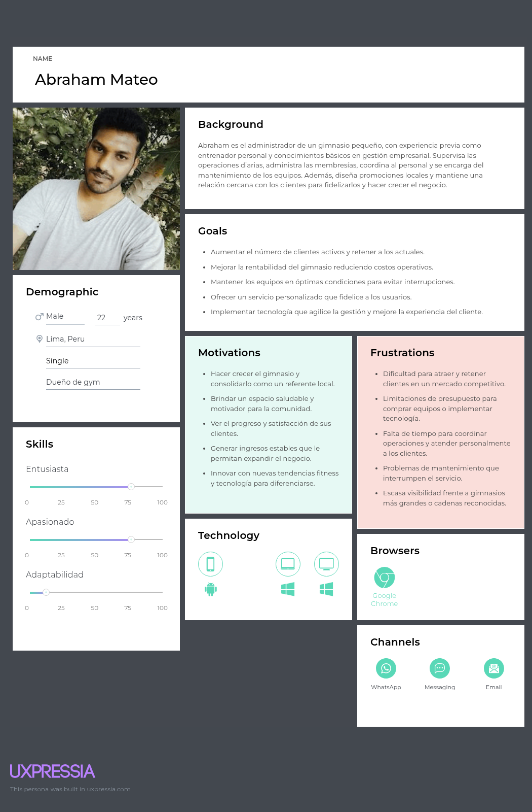

**SSegmento 2: Clientes y usuarios de servicios de entrenamiento**
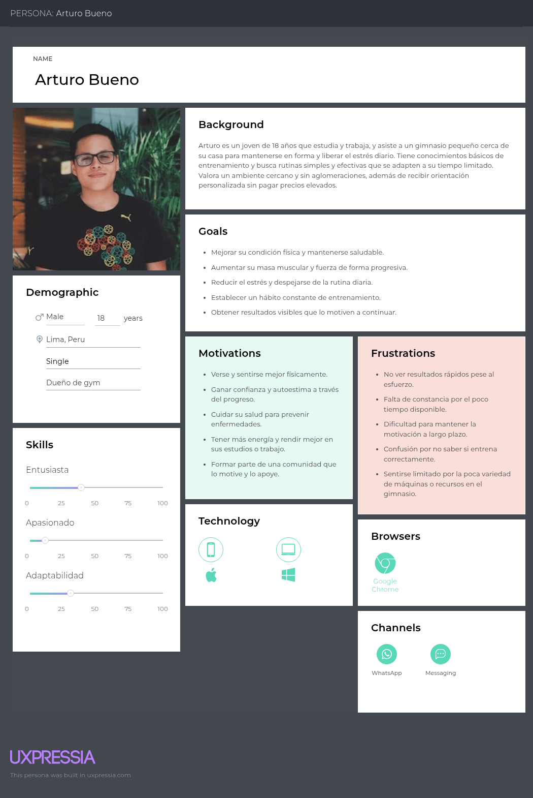

### 2.3.2. User Task Matrix.
<table>
  <thead>
    <tr>
      <th>User Task</th>
      <th colspan="2">Abraham (Administrador)</th>
      <th colspan="2">Arturo (Usuario)</th>
    </tr>
    <tr>
      <th></th>
      <th>Frecuencia</th>
      <th>Importancia</th>
      <th>Frecuencia</th>
      <th>Importancia</th>
    </tr>
  </thead>
  <tbody>
    <tr>
      <td>Revisar acceso y aforo del gimnasio</td>
      <td>Very Often</td>
      <td>High</td>
      <td>Often</td>
      <td>High</td>
    </tr>
    <tr>
      <td>Gestionar/renovar membresías</td>
      <td>Often</td>
      <td>High</td>
      <td>Sometimes</td>
      <td>High</td>
    </tr>
    <tr>
      <td>Monitorear métricas (ritmo cardíaco/agregados)</td>
      <td>Sometimes</td>
      <td>High</td>
      <td>Often</td>
      <td>High</td>
    </tr>
    <tr>
      <td>Programar clases y cupos</td>
      <td>Often</td>
      <td>High</td>
      <td>Sometimes</td>
      <td>Medium</td>
    </tr>
    <tr>
      <td>Recibir alertas (equipos/incidencias/esfuerzo)</td>
      <td>Sometimes</td>
      <td>High</td>
      <td>Often</td>
      <td>High</td>
    </tr>
    <tr>
      <td>Consultar recomendaciones automáticas</td>
      <td>Rarely</td>
      <td>Medium</td>
      <td>Often</td>
      <td>High</td>
    </tr>
    <tr>
      <td>Generar/recibir reportes</td>
      <td>Often</td>
      <td>High</td>
      <td>Rarely</td>
      <td>Medium</td>
    </tr>
    <tr>
      <td>Recibir recordatorios (renovación/entrenamiento)</td>
      <td>Rarely</td>
      <td>Medium</td>
      <td>Very Often</td>
      <td>High</td>
    </tr>
  </tbody>
</table>

### 2.3.3. User Journey Mapping.
  
**Segmento Propietario/Administrador:**


**Segmento Miembro de Gimnasio:**


### 2.3.4. Empathy Mapping.
**Segmento Propietario/Administrador:**

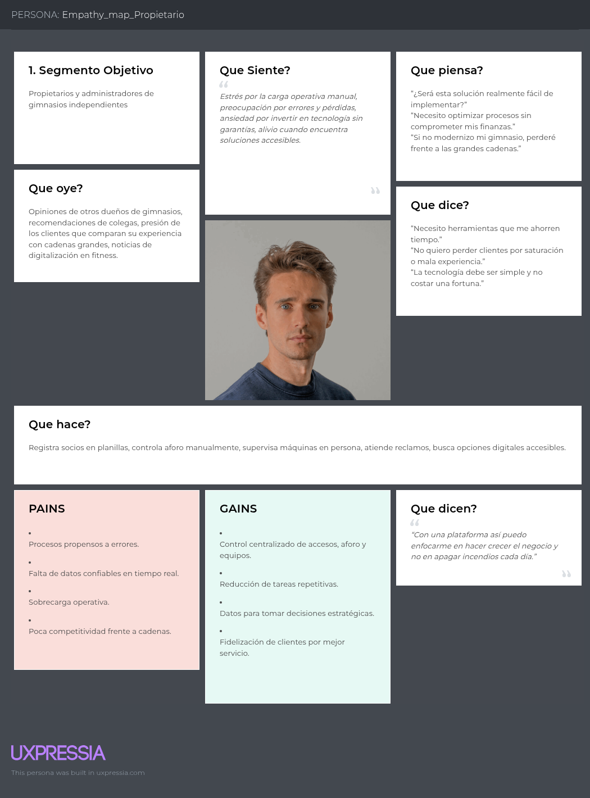

**Segmento Miembro de Gimnasio:**

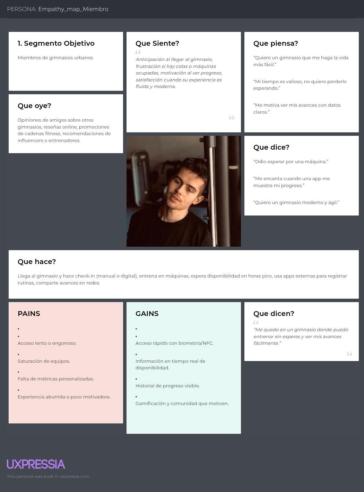

## 2.4 Big Picture EventStorming.

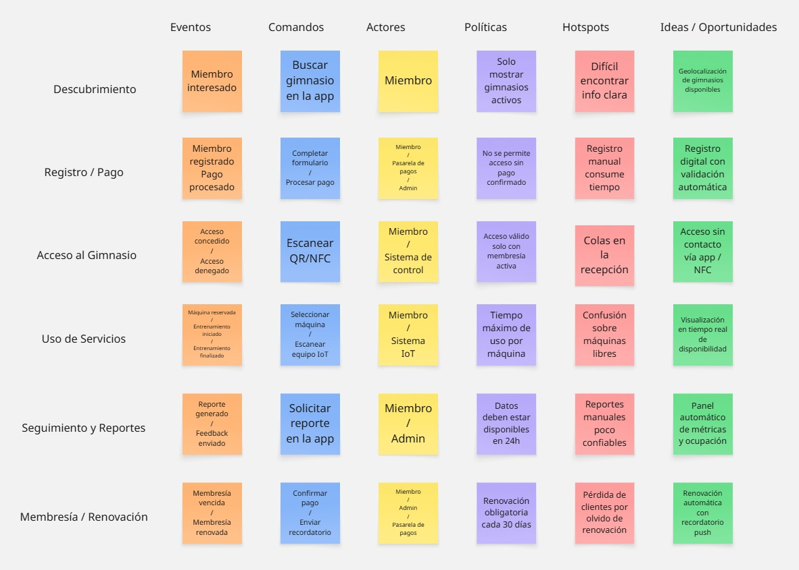

## 2.5. Ubiquitous Language.

| **Término**             | **Definición clara en el dominio** |
|--------------------------|-------------------------------------|
| **Cliente de Gimnasio**              | Persona inscrita en el gimnasio con una membresía activa o vencida. |
| **Administrador de Gimnasio**        | Staff responsable de gestionar accesos, membresías, aforo y reportes. |
| **Membresía**            | Plan adquirido por un miembro que define acceso, vigencia y beneficios. |
| **Check-in**             | Proceso de validación de acceso de un miembro al gimnasio (biometría, NFC, QR). |
| **Check-out**            | Registro de salida de un miembro del gimnasio. |
| **Acceso concedido**     | Estado que confirma que un miembro puede entrar al gimnasio. |
| **Acceso denegado**      | Estado que indica que un miembro no puede ingresar (ej. membresía vencida). |
| **Equipo / Máquina**     | Dispositivo de entrenamiento en el gimnasio (caminadora, bicicleta, etc.) con posible integración IoT. |
| **Uso de máquina**       | Período de tiempo en el que un miembro utiliza un equipo, registrado por sensores IoT. |
| **Reserva de máquina**   | Acción de apartar un equipo por tiempo determinado desde la app. |
| **Aforo**                | Número de personas presentes en el gimnasio en tiempo real. |
| **Reporte de uso**       | Documento digital con métricas de asistencia, ocupación y uso de equipos. |
| **Historial de entrenamiento** | Registro individual de visitas, uso de equipos y métricas personales del miembro. |
| **Dashboard administrativo** | Interfaz para administradores con datos en tiempo real de aforo, accesos y equipos. |
| **Aplicación móvil (App)** | Herramienta digital para miembros que permite gestionar accesos, reservas, métricas y membresías. |
| **Notificación push**    | Mensaje automático enviado al móvil del miembro (recordatorios, alertas, renovaciones). |
| **Hotspot**              | Problema identificado en el flujo del gimnasio que requiere atención o mejora. |
| **Gamificación**         | Estrategias digitales para motivar al miembro (retos, badges, logros). |
| **IoT Sensor**           | Dispositivo conectado que mide variables de uso de equipos, presencia o ritmo cardíaco. |
| **Renovación automática** | Proceso en el que la membresía se reactiva mediante pago recurrente. |
| **Engagement**           | Nivel de involucramiento del miembro con el gimnasio a través de la app y servicios. |
| **Fidelización**         | Estrategia para mantener miembros activos por más tiempo a través de experiencia y beneficios. |


# Capítulo III: Requirements Specification

## 3.1. User Stories.

| ID Épica | Nombre de la Épica             | Descripción                                                                 |
|----------|--------------------------------|-----------------------------------------------------------------------------|
| EP01     | Gestión de accesos             | Controlar entradas y salidas con distintos métodos de autenticación como NFC, biometría o tarjetas. |
| EP02     | Seguridad y monitoreo          | Garantizar la seguridad del edificio mediante alertas en tiempo real, paneles de control y gestión de incidentes. |
| EP03     | Monitoreo de ocupación         | Medir y visualizar la cantidad de personas en zonas del edificio en tiempo real y con reportes históricos. |
| EP04     | Infraestructura IoT Edge       | Asegurar que el sistema funcione localmente cuando no haya conexión a internet y que sincronice los datos con la nube. |
| EP05     | Integración corporativa        | Conectar el sistema con servicios y directorios existentes como Active Directory, LDAP o APIs de terceros. |
| EP06     | Administración y reporting     | Brindar a administradores y propietarios reportes financieros, de uso de espacios y estadísticas para toma de decisiones. |
| EP07     | Experiencia del usuario final  | Ofrecer a empleados y visitantes accesos rápidos, simples y confiables mediante aplicaciones o dispositivos. |
| EP08     | Gestión técnica y mantenimiento| Permitir a equipos de TI y operadores gestionar dispositivos IoT, realizar actualizaciones y monitorear el estado del sistema. |
| EP09     | Landing Page y marketing       | Mostrar información pública del servicio, beneficios, características principales y contacto para nuevos clientes. |


| ID   | Título                      | Descripción                                                                                      | Criterios de Aceptación                                                                                                        | Relacionado con (Epic ID) |
|------|-----------------------------|--------------------------------------------------------------------------------------------------|--------------------------------------------------------------------------------------------------------------------------------|---------------------------|
| US01 | Acceso con huella biométrica| Como miembro quiero ingresar al gimnasio con mi huella para evitar el uso de credenciales físicas| Given que la huella está enrolada, When el miembro presenta la huella, Then el sistema valida y permite el ingreso.<br>Given que la huella no coincide, When el miembro intenta ingresar, Then el sistema rechaza el acceso y registra el intento fallido. | EP01                      |
| US02 | Registro de entrada y salida| Como administrador quiero que el sistema registre entradas y salidas para controlar la ocupación en tiempo real| Given que un miembro ingresa, When se valida el acceso, Then el sistema registra la hora de entrada.<br>Given que un miembro sale, When se detecta el check-out, Then el sistema registra la hora de salida. | EP01                      |
| US03 | Bloqueo de acceso            | Como administrador quiero bloquear el acceso de un miembro con plan vencido para cumplir con las reglas del gimnasio| Given que el plan está vencido, When el miembro intenta ingresar, Then el sistema rechaza el acceso y muestra un registro en la bitácora.<br>Given que el administrador bloquea un miembro manualmente, When este intenta acceder, Then el sistema rechaza la validación. | EP01                      |
| US04 | Acceso con tarjeta NFC       | Como miembro quiero ingresar al gimnasio con tarjeta NFC para contar con otra opción de autenticación rápida| Given que la tarjeta NFC está vinculada, When el miembro presenta la tarjeta, Then el sistema valida y abre el acceso.<br>Given que la tarjeta no está registrada, When se intenta usar, Then el sistema rechaza el acceso y lo registra como intento fallido. | EP01                      |
| US05 | Consulta de estado del plan    | Como miembro quiero consultar el estado de mi plan para saber si está vigente o próximo a vencer           | Given que el miembro accede a la app, When consulta su plan, Then el sistema muestra si está vigente, vencido o en pausa.                      | EP02                      |
| US06 | Renovación de membresía        | Como administrador quiero registrar la renovación de un plan para mantener actualizado el estado del miembro| Given que el administrador renueva el plan, When guarda los cambios, Then el sistema actualiza el estado y registra la fecha de vigencia.      | EP02                      |
| US07 | Suspensión de membresía        | Como administrador quiero suspender temporalmente un plan para atender solicitudes especiales de miembros   | Given que el administrador suspende un plan, When confirma la acción, Then el sistema cambia el estado a suspendido y guarda la trazabilidad. | EP02                      |
| US08 | Validación de acceso por plan  | Como miembro quiero que el sistema valide mi plan antes de ingresar para cumplir con las reglas del gimnasio| Given que el plan está vigente, When el miembro intenta ingresar, Then el acceso se autoriza.<br>Given que el plan está vencido, When intenta ingresar, Then el sistema rechaza el acceso. | EP02                      |
| US09 | Consulta de aforo actual       | Como miembro quiero consultar el aforo en tiempo real para decidir el mejor momento de ir al gimnasio       | Given que el miembro abre la app, When solicita aforo, Then el sistema muestra número de usuarios activos y porcentaje de ocupación.           | EP03                      |
| US10 | Monitoreo de aforo por sede    | Como administrador quiero visualizar el aforo por sede para supervisar la ocupación y tomar decisiones      | Given que el administrador ingresa al dashboard, When selecciona la sede, Then el sistema muestra número de usuarios actuales en tiempo real. | EP03                      |
| US11 | Alertas de sobreocupación      | Como administrador quiero recibir alertas cuando la ocupación supere el límite permitido                    | Given que la ocupación excede el 90%, When ocurre la validación, Then el sistema genera una alerta en el dashboard y envía notificación.      | EP03                      |
| US12 | Historial de visitas           | Como miembro quiero consultar mi historial de visitas para llevar un registro de asistencia personal        | Given que el miembro accede a la sección historial, When solicita ver registros, Then el sistema muestra entradas y salidas con fechas.       | EP03                      |
| US13 | Buffer de eventos en el IoT Edge                    | Como administrador quiero que el gateway IoT almacene eventos localmente cuando la conexión a la nube se pierde, para evitar pérdida de datos. | Given que el gateway pierde conexión con la nube, When los dispositivos generan eventos, Then el gateway almacena localmente cada evento con timestamp y identificador único.<br>Given que el gateway recupera la conexión, When inicia la sincronización, Then el gateway envía los eventos almacenados en el orden original y marca cada evento como sincronizado.<br>Given que la nube recibe el mismo evento duplicado, When se detecta duplicado, Then el sistema descarta el duplicado y conserva un único registro. | EP04                      |
| US14 | Autorización local durante corte de nube            | Como miembro quiero que el gateway permita el acceso si mi autorización está en caché del borde cuando la nube está inalcanzable. | Given que la autorización del miembro está en la caché del gateway, When el miembro presenta su credencial y la nube no está disponible, Then el gateway autoriza el acceso y registra el evento localmente.<br>Given que la autorización no está en la caché, When el miembro intenta acceder durante la desconexión, Then el gateway deniega el acceso y registra el intento.                                                         | EP04                      |
| US15 | Estado operativo del IoT Edge                       | Como administrador quiero conocer el estado operativo del gateway para reaccionar ante fallos.                          | Given que el gateway está operativo, When el administrador consulta el estado, Then el sistema informa "online" con el último heartbeat y la versión del firmware.<br>Given que el gateway no responde, When el administrador consulta el estado, Then el sistema informa "offline" con la marca de tiempo del último heartbeat y el código de error si está disponible.                                           | EP04                      |
| US16 | Actualización remota de firmware del gateway        | Como administrador quiero aplicar actualizaciones de firmware al gateway de manera remota para mantener seguridad y estabilidad. | Given que existe un paquete de firmware válido, When el administrador solicita la actualización, Then el gateway descarga, instala la actualización y reporta el resultado de la operación.<br>Given que la instalación falla, When el gateway detecta fallo, Then el gateway ejecuta el rollback a la versión previa y reporta el error.                                                    | EP04                      |
| US17 | Sincronización de usuarios desde directorio corporativo | Como administrador quiero sincronizar usuarios desde el directorio corporativo para mantener consistencia de cuentas.    | Given que el directorio contiene un registro de usuario con atributos requeridos, When la tarea de sincronización se ejecuta, Then el sistema crea o actualiza el registro local con los atributos mapeados y asigna el rol por defecto si aplica.<br>Given que el registro en el directorio está deshabilitado, When la sincronización detecta esto, Then el sistema marca el usuario como deshabilitado localmente. | EP05                      |
| US18 | Autenticación con SSO corporativo                   | Como miembro quiero autenticarme con mis credenciales corporativas para usar la misma identidad.                         | Given que el SSO está configurado y el miembro dispone de credenciales corporativas válidas, When el miembro inicia sesión usando SSO, Then el sistema valida el token y emite un token de acceso local que identifica al miembro.<br>Given que el token SSO es inválido o expirado, When el miembro intenta iniciar sesión, Then el sistema rechaza la autenticación y registra el intento.         | EP05                      |
| US19 | Propagación de cambios de roles desde el directorio | Como administrador quiero que los cambios de rol en el directorio se reflejen en el sistema para mantener permisos consistentes. | Given que el rol de un usuario cambia en el directorio, When la sincronización detecta el cambio, Then el sistema actualiza el rol del usuario local y registra el cambio en la bitácora.<br>Given que el directorio envía un rol no mapeado, When el sistema recibe el rol, Then el sistema asigna el rol por defecto y registra la incidencia para revisión.                                    | EP05                      |
| US20 | Generar reporte de ocupación por periodo            | Como administrador quiero generar reportes de ocupación en un rango de fechas para analizar uso de las instalaciones.    | Given que el administrador solicita un reporte con un rango de fechas válido, When el sistema procesa la solicitud, Then el sistema devuelve un reporte con total de visitas, ocupación máxima por periodo y ocupación promedio.<br>Given que el rango de fechas es inválido, When se procesa la solicitud, Then el sistema responde con error 400 y mensaje descriptivo.                         | EP06                      |
| US21 | Exportar reportes en formato CSV                    | Como administrador quiero exportar reportes en CSV para realizar análisis externos.                                    | Given que un reporte está disponible, When el administrador solicita la exportación, Then el sistema entrega el archivo CSV con campos: fecha, site_id, ocupacion_actual, ocupacion_maxima.<br>Given que ocurre un fallo en la generación del archivo, When el administrador solicita la exportación, Then el sistema responde con error 500 y registra el fallo.                          | EP06                      |
| US22 | Descarga de historial personal                      | Como miembro quiero descargar mi historial de visitas para revisar mi asistencia.                                      | Given que el miembro tiene registros de visitas en el rango solicitado, When el miembro solicita su historial, Then el sistema devuelve la lista de visitas con timestamps de entrada y salida.<br>Given que no existen registros en el rango solicitado, When el miembro solicita su historial, Then el sistema devuelve una lista vacía.                                       | EP06                      |
| US23 | Alertas por anomalías en patrones de acceso         | Como administrador quiero recibir alertas cuando se detecten patrones anormales de acceso para investigar incidentes.   | Given que las reglas de anomalía detectan un patrón (ej. múltiples accesos fallidos o picos inusuales), When ocurre la detección, Then el sistema genera una alerta con tipo de incidente, site_id y marcas de tiempo.<br>Given que la alerta existe, When el administrador consulta la lista de alertas, Then el sistema presenta la alerta con estado "new" hasta que se marque como "reviewed". | EP06                      |
| US24 | Integración con pasarela de pagos Culqi          | Como miembro quiero realizar pagos mediante Culqi para completar mis transacciones en la aplicación. | Given que el miembro selecciona un plan de pago válido, When procede a pagar con Culqi, Then el sistema redirige a la pasarela de Culqi y confirma el resultado.<br>Given que la transacción es exitosa, When Culqi devuelve la confirmación, Then el sistema registra el pago, activa el servicio y muestra un comprobante digital al miembro.                | EP07                      |
| US25 | Gestión de reembolsos                            | Como administrador quiero procesar reembolsos en Culqi para resolver incidencias de pago.            | Given que existe una transacción confirmada, When el administrador solicita un reembolso válido, Then el sistema envía la solicitud a Culqi y actualiza el estado de la transacción a "reembolsado".<br>Given que Culqi rechaza el reembolso, When el administrador consulta el estado, Then el sistema muestra el error y mantiene el estado original.          | EP07                      |
| US26 | Registro de facturación automática               | Como administrador quiero que el sistema genere comprobantes al completarse un pago con Culqi.       | Given que una transacción es exitosa, When Culqi envía confirmación, Then el sistema genera automáticamente un comprobante con número de operación, monto, fecha y datos del miembro.<br>Given que falla la generación, When el sistema intenta registrar el comprobante, Then notifica el error al administrador y marca el pago como pendiente de facturación. | EP07                      |
| US27 | Registro de logs de auditoría                    | Como administrador quiero que todas las operaciones relevantes se registren en un log de auditoría.  | Given que un usuario realiza una acción (ej. inicio de sesión, actualización de rol, pago), When la acción se completa, Then el sistema registra un evento en el log con usuario, acción, timestamp y resultado.<br>Given que un administrador consulta los logs, When solicita un rango de fechas, Then el sistema devuelve los eventos en orden cronológico. | EP08                      |
| US28 | Control de accesos por rol                       | Como administrador quiero definir permisos por rol para restringir acciones sensibles.                | Given que un usuario intenta realizar una acción, When el rol asignado no tiene permiso, Then el sistema bloquea la acción y registra el intento en el log.<br>Given que el usuario tiene permiso, When realiza la acción, Then el sistema la ejecuta y registra el evento en auditoría.                                                                    | EP08                      |
| US29 | Notificación de intentos fallidos                | Como administrador quiero recibir notificaciones de intentos de acceso fallidos para detectar riesgos.| Given que un miembro intenta iniciar sesión repetidamente con credenciales incorrectas, When el número de intentos excede el umbral, Then el sistema envía una notificación al administrador con detalles del usuario, IP y timestamp.<br>Given que el administrador consulta la notificación, Then puede marcarla como atendida o pendiente.                 | EP08                      |
| US30 | Visualización de información general en landing  | Como miembro quiero visualizar información clara en la landing page para entender la propuesta.      | Given que el visitante accede a la landing, When se carga la página, Then el sistema muestra secciones de valor, beneficios, planes y llamadas a la acción con botones de registro o contacto.<br>Given que el visitante cambia de idioma (ej. ES/EN), When selecciona la opción, Then el sistema muestra la misma información en el idioma elegido.            | EP09                      |
| US31 | Formulario de contacto                           | Como miembro quiero llenar un formulario de contacto en la landing para solicitar más información.   | Given que el visitante completa los campos obligatorios (nombre, correo, mensaje), When envía el formulario, Then el sistema valida los campos y envía la solicitud al correo de soporte.<br>Given que falta un campo obligatorio, When intenta enviar, Then el sistema muestra un mensaje de error y no envía el formulario.                             | EP09                      |
| US32 | Registro inicial desde la landing                | Como miembro quiero registrarme desde la landing para comenzar a usar la aplicación.                 | Given que el visitante accede a la landing, When selecciona la opción de registrarse, Then el sistema redirige al flujo de registro en la aplicación.<br>Given que el visitante completa los datos requeridos, When confirma el registro, Then el sistema crea la cuenta y lo redirige al panel inicial de la aplicación.                               | EP09                      |
| TS01 | API de autenticación segura | Como Developer, necesito implementar autenticación con JWT en Flask para proteger los recursos internos. | **Given** un usuario con credenciales válidas **When** realiza login **Then** recibe un token JWT. <br> **Given** credenciales inválidas **When** intenta login **Then** recibe error 401. | EP02 |
| TS02 | Middleware de validación de token | Como Developer, necesito middleware en Flask que valide tokens JWT en los endpoints protegidos. | **Given** un request con token válido **When** llega a un endpoint protegido **Then** se autoriza. <br> **Given** un token inválido **When** intenta acceso **Then** recibe error 403. | EP02 |
| TS03 | Configuración de base de datos MySQL | Como Developer, necesito conectar el monolito en Flask a una instancia de MySQL para almacenar usuarios, membresías y datos de IoT. | **Given** la aplicación corriendo **When** ejecuta conexión a MySQL **Then** debe ser exitosa. <br> **Given** query inválida **When** se ejecuta **Then** retorna error controlado. | EP01 |
| TS04 | Gestión de equipos IoT en backend | Como Developer, necesito implementar módulos internos en Flask para registrar y actualizar equipos IoT Edge. | **Given** un request válido **When** se registra un dispositivo **Then** queda guardado en MySQL. | EP04 |
| TS05 | Monitoreo y almacenamiento de sensores | Como Developer, necesito que el backend reciba datos de sensores IoT Edge y los almacene en la base de datos. | **Given** un sensor transmite datos **When** llegan al backend **Then** se registran en MySQL. | EP04 |
| TS06 | Configuración HTTPS en Flask | Como Developer, necesito habilitar HTTPS para que todas las comunicaciones cliente-servidor estén cifradas. | **Given** un request por HTTPS **When** llega al servidor **Then** se procesa correctamente. <br> **Given** un request HTTP **When** llega al servidor **Then** se redirige a HTTPS. | EP02 |
| TS07 | Implementación de CORS seguro | Como Developer, necesito configurar CORS en Flask para aceptar únicamente dominios autorizados. | **Given** un request desde dominio autorizado **When** llega al servidor **Then** se permite. <br> **Given** un dominio no autorizado **When** intenta acceder **Then** se bloquea con error 403. | EP02 |
| TS08 | Logs de auditoría | Como Developer, necesito implementar registro de eventos de acceso y operaciones críticas en el sistema monolítico. | **Given** un usuario accede con éxito **When** inicia sesión **Then** se registra en los logs. <br> **Given** ocurre un error crítico **When** se genera excepción **Then** se guarda en los logs. | EP01 |
| TS09 | API de pagos con Culqi | Como Developer, necesito integrar en el monolito la API de Culqi para procesar pagos de membresías. | **Given** datos de tarjeta válidos **When** se procesan **Then** Culqi responde con transacción confirmada. <br> **Given** datos inválidos **When** se procesan **Then** se rechaza el pago. | EP06 |
| TS10 | Envío de notificaciones internas | Como Developer, necesito implementar un módulo en Flask que gestione notificaciones por correo electrónico para administradores y miembros. | **Given** un evento programado **When** ocurre (ej. mantenimiento) **Then** se envía notificación por correo. | EP05 |

## 3.2. Impact Mapping.

**Segmento 1:**


**Segmento 1:**


## 3.3. Product Backlog.

| #Orden | User Story ID | Titulo| Descripción| Story Points (1/2/3/5/8) |
| ------ | ------------- | ----- | ---------- | ------------------------ |
| 1 | US30 | Visualización de información en landing | Como miembro quiero visualizar información clara en la landing page para entender la propuesta. | 2 |
| 2 | US31 | Formulario de contacto | Como miembro quiero llenar un formulario de contacto en la landing para solicitar más información. | 1 |
| 3 | US32 | Registro inicial desde la landing | Como miembro quiero registrarme desde la landing para comenzar a usar la aplicación. | 2 |
| 4 | US01 | Acceso con huella biométrica | Como miembro quiero ingresar al gimnasio con mi huella para evitar el uso de credenciales físicas. | 5 |
| 5 | US02 | Registro de entrada y salida | Como administrador quiero que el sistema registre entradas y salidas para controlar la ocupación en tiempo real. | 5 |
| 6 | US03 | Bloqueo de acceso | Como administrador quiero bloquear el acceso de un miembro con plan vencido para cumplir con las reglas del gimnasio. | 3 |
| 7 | US04 | Acceso con tarjeta NFC | Como miembro quiero ingresar al gimnasio con tarjeta NFC para contar con otra opción de autenticación rápida. | 3 |
| 8 | US05 | Consulta de estado del plan | Como miembro quiero consultar el estado de mi plan para saber si está vigente o próximo a vencer. | 2 |
| 9 | US06 | Renovación de membresía | Como administrador quiero registrar la renovación de un plan para mantener actualizado el estado del miembro. | 3 |
| 10 | US07 | Suspensión de membresía | Como administrador quiero suspender temporalmente un plan para atender solicitudes especiales de miembros. | 2 |
| 11 | US08 | Validación de acceso por plan | Como miembro quiero que el sistema valide mi plan antes de ingresar para cumplir con las reglas del gimnasio. | 3 |
| 23 | US20 | Generar reporte de ocupación por periodo | Como administrador quiero generar reportes de ocupación en un rango de fechas para analizar uso de las instalaciones. | 5 |
| 24 | US23 | Alertas por anomalías en accesos | Como administrador quiero recibir alertas cuando se detecten patrones anormales de acceso para investigar incidentes. | 3 |
| 25 | US21 | Exportar reportes en formato CSV | Como administrador quiero exportar reportes en CSV para realizar análisis externos. | 2 |
| 26 | US25 | Gestión de reembolsos | Como administrador quiero procesar reembolsos en Culqi para resolver incidencias de pago. | 3 |
| 27 | US22 | Descarga de historial personal | Como miembro quiero descargar mi historial de visitas para revisar mi asistencia. | 2 |
| 28 | US24 | Integración con pasarela de pagos Culqi | Como miembro quiero realizar pagos mediante Culqi para completar mis transacciones en la aplicación. | 5 |
| 29 | US27 | Registro de logs de auditoría | Como administrador quiero que todas las operaciones relevantes se registren en un log de auditoría. | 3 |
| 30 | US26 | Registro de facturación automática | Como administrador quiero que el sistema genere comprobantes al completarse un pago con Culqi. | 3 |
| 31 | US28 | Control de accesos por rol | Como administrador quiero definir permisos por rol para restringir acciones sensibles. | 3 |
| 32 | US29 | Notificación de intentos fallidos | Como administrador quiero recibir notificaciones de intentos de acceso fallidos para detectar riesgos. | 2 |
| 33 | US10 | Monitoreo de aforo por sede | Como administrador quiero visualizar el aforo por sede para supervisar la ocupación y tomar decisiones. | 5 |
| 12 | TS01 | API de autenticación segura | Como Developer necesito implementar autenticación con JWT en Flask para proteger los recursos internos. | 5 |
| 13 | TS03 | Configuración de base de datos MySQL | Como Developer necesito conectar el monolito en Flask a una instancia de MySQL para almacenar usuarios, membresías y datos de IoT. | 5 |
| 14 | TS02 | Middleware de validación de token | Como Developer necesito middleware en Flask que valide tokens JWT en los endpoints protegidos. | 3 |
| 15 | TS06 | Configuración HTTPS en Flask | Como Developer necesito habilitar HTTPS para que todas las comunicaciones cliente-servidor estén cifradas. | 3 |
| 16 | TS07 | Implementación de CORS seguro | Como Developer necesito configurar CORS en Flask para aceptar únicamente dominios autorizados. | 2 |
| 17 | TS09 | API de pagos con Culqi | Como Developer necesito integrar en el monolito la API de Culqi para procesar pagos de membresías. | 5 |
| 18 | TS08 | Logs de auditoría | Como Developer necesito implementar registro de eventos de acceso y operaciones críticas en el sistema monolítico. | 3 |
| 19 | TS04 | Gestión de equipos IoT en backend | Como Developer necesito implementar módulos internos en Flask para registrar y actualizar equipos IoT Edge. | 3 |
| 20 | TS05 | Monitoreo y almacenamiento de sensores | Como Developer necesito que el backend reciba datos de sensores IoT Edge y los almacene en la base de datos. | 3 |
| 21 | TS10 | Envío de notificaciones internas | Como Developer necesito implementar un módulo en Flask que gestione notificaciones por correo electrónico para administradores y miembros. | 2 |
| 22 | US02 | Registro de entrada y salida | Como administrador quiero que el sistema registre entradas y salidas para controlar la ocupación en tiempo real. | 5 |
| 23 | US10 | Monitoreo de aforo por sede | Como administrador quiero visualizar el aforo por sede para supervisar la ocupación y tomar decisiones. | 5 |
| 24 | US13 | Buffer de eventos en el IoT Edge | Como administrador quiero que el gateway IoT almacene eventos localmente cuando la conexión a la nube se pierde, para evitar pérdida de datos. | 5 |
| 25 | US14 | Autorización local durante corte de nube | Como miembro quiero que el gateway permita el acceso si mi autorización está en caché del borde cuando la nube está inalcanzable. | 3 |
| 26 | US09 | Consulta de aforo actual | Como miembro quiero consultar el aforo en tiempo real para decidir el mejor momento de ir al gimnasio. | 3 |
| 27 | US11 | Alertas de sobreocupación | Como administrador quiero recibir alertas cuando la ocupación supere el límite permitido. | 3 |
| 28 | US15 | Estado operativo del IoT Edge | Como administrador quiero conocer el estado operativo del gateway para reaccionar ante fallos. | 3 |
| 29 | US16 | Actualización remota de firmware del gateway | Como administrador quiero aplicar actualizaciones de firmware al gateway de manera remota para mantener seguridad y estabilidad. | 5 |
| 30 | US27 | Registro de logs de auditoría | Como administrador quiero que todas las operaciones relevantes se registren en un log de auditoría. | 3 |
| 31 | US23 | Alertas por anomalías en accesos | Como administrador quiero recibir alertas cuando se detecten patrones anormales de acceso para investigar incidentes. | 3 |
| 32 | US29 | Notificación de intentos fallidos | Como administrador quiero recibir notificaciones de intentos de acceso fallidos para detectar riesgos. | 2 |
| 33 | US20 | Generar reporte de ocupación por periodo | Como administrador quiero generar reportes de ocupación en un rango de fechas para analizar uso de las instalaciones. | 5 |
| 34 | US21 | Exportar reportes en formato CSV | Como administrador quiero exportar reportes en CSV para realizar análisis externos. | 2 |
| 35 | US24 | Integración con pasarela de pagos Culqi | Como miembro quiero realizar pagos mediante Culqi para completar mis transacciones en la aplicación. | 5 |
| 36 | US26 | Registro de facturación automática | Como administrador quiero que el sistema genere comprobantes al completarse un pago con Culqi. | 3 |
| 37 | US25 | Gestión de reembolsos | Como administrador quiero procesar reembolsos en Culqi para resolver incidencias de pago. | 3 |
| 38 | US22 | Descarga de historial personal | Como miembro quiero descargar mi historial de visitas para revisar mi asistencia. | 2 |
| 39 | US12 | Historial de visitas | Como miembro quiero consultar mi historial de visitas para llevar un registro de asistencia personal. | 2 |
| 40 | US17 | Sincronización de usuarios desde directorio corporativo | Como administrador quiero sincronizar usuarios desde el directorio corporativo para mantener consistencia de cuentas. | 3 |
| 41 | US18 | Autenticación con SSO corporativo | Como miembro quiero autenticarme con mis credenciales corporativas para usar la misma identidad. | 3 |
| 42 | US19 | Propagación de cambios de roles | Como administrador quiero que los cambios de rol en el directorio se reflejen en el sistema para mantener permisos consistentes. | 2 |

# Capítulo IV: Solution Software Design
## 4.1. Strategic-Level Domain-Driven Design.
### 4.1.1. Design-Level EventStorming.
En esta sección nos reunimos todo el equipo para realizar una lluvia de ideas sobre los eventos que ocurrirían en la aplicación. Primero se empezó por poner en una pizarra todos los eventos del dominio que se nos ocurrieran que podría tener la aplicación. Despúes empezamos a agregar los commandos que desencadenan los eventos. Finalmente ya se agregaron los demás elementos como actores, políticas, aggregates, sistemas externos, y modelos de lectura. Poco a poco al hacer esto seempezaron a formar pequeños flujos de eventos que nos serviriían para el siguiente punto

#### 4.1.1.1 Candidate Context Discovery.
En esta sección el equipo se puso a organizar los elementos resultantes el event storming. Primero nos pusimos a identificar los eventos y flujos que consideramos eran os mas importantes, para separarlos que sean el core del dominio. Despues estuvimos descomponiendo los eventos en steps secuenciales y buscando eventos clave que provoquen cambios de estado en el sistema.
Finalmente, con todos estos pasos pudimos segmentar los eventos para que se adecuen a las necesidades del negocio, dando como resultado nuestros Bounded Context

#### 4.1.1.2 Domain Message Flows Modeling.


#### 4.1.1.3 Bounded Context Canvases.
En esta sección sección se ha realizado Canvas para los bounded context. La finalidad es obtener un diagrama informativo sobre
cada bounded context con información clave de este en el negocio.

### 4.1.2. Context Mapping.
En esta seccion se presentara nuestro diagrama de contexto para nuestro software, este diagrama nos muestro como nuestro
sistema interactua con sus alrededor y usuarios

### 4.1.3. Software Architecture.
#### 4.1.3.1. Software Architecture System Landscape Diagram.
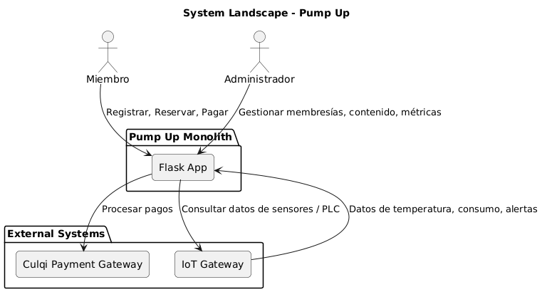
#### 4.1.3.2. Software Architecture Context Level Diagrams.
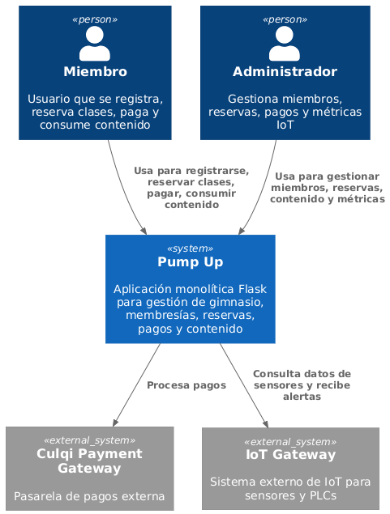
#### 4.1.3.2. Software Architecture Container Level Diagrams.
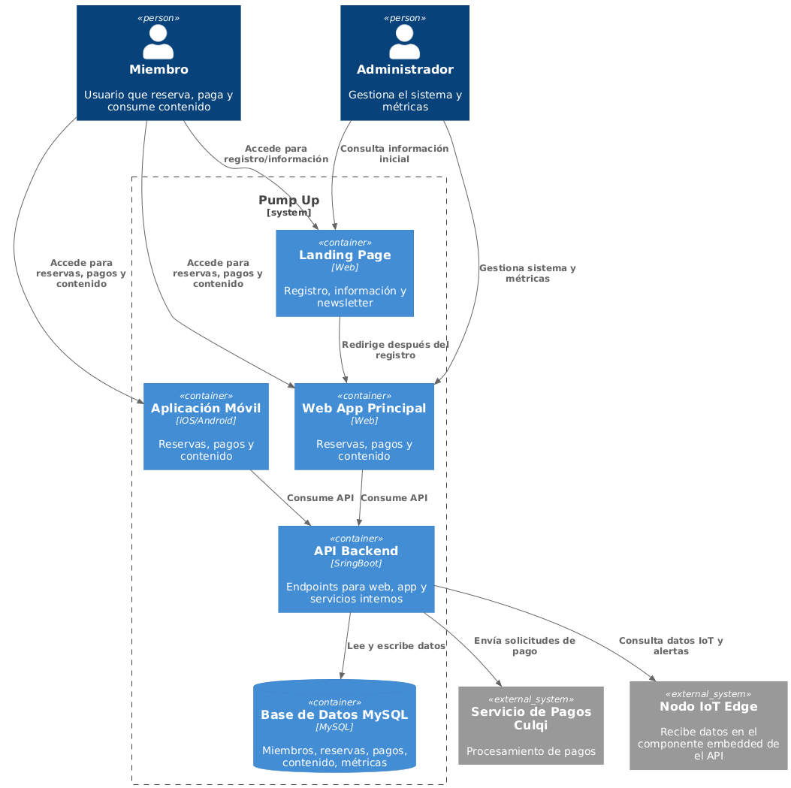
#### 4.1.3.3. Software Architecture Deployment Diagrams.

## 4.2. Tactical-Level Domain-Driven Design
### 4.2.1. Bounded Context: Identity & Access (IAM)
#### 4.2.1.1. Domain Layer.
| Clase        | Tipo                     | Propósito                                                                                      |
|--------------|--------------------------|------------------------------------------------------------------------------------------------|
| User         | Aggregate Root (Entity)  | Representa un usuario del sistema (miembro o staff), mantiene estado y roles asignados, y gestiona validación de contraseña. |
| Role         | Entity                   | Define roles posibles: Staff o Miembro.                                                        |
| Password     | Value Object             | Encapsula la contraseña hasheada y ofrece métodos de validación segura.                        |
| LoginAttempt | Entity / Value Object    | Representa un intento de inicio de sesión, con timestamp, resultado y dispositivo usado.        |
| UserStatus   | Enum                     | Estados posibles: Active, Inactive, Locked.                                                    |
| RoleType     | Enum                     | Tipos de roles: Staff, Member.                                                                 |

#### 4.2.1.2. Interface Layer.
| Clase          | Tipo                    | Propósito                                                                 |
|----------------|-------------------------|---------------------------------------------------------------------------|
| UserController | Controller              | Endpoints REST para login, asignación de roles y verificación de permisos. |
| AuthMiddleware | Middleware / Consumer   | Valida JWT en cada petición y agrega contexto de usuario al request.       |


#### 4.2.1.3. Application Layer.
| Clase                    | Tipo                  | Propósito                                                                 |
|---------------------------|-----------------------|---------------------------------------------------------------------------|
| LoginCommandHandler       | Command Handler       | Procesa el comando de login, valida contraseña y genera JWT temporal en memoria. |
| AssignRoleCommandHandler  | Command Handler       | Asigna o cambia roles de usuarios según reglas de negocio.                 |
| ValidateAccessHandler     | Command/Event Handler | Verifica si un usuario tiene permiso para ejecutar una acción específica.  |
#### 4.2.1.4. Infrastructure Layer.
| Clase           | Tipo                | Propósito                                                                  |
|-----------------|---------------------|----------------------------------------------------------------------------|
| UserRepository  | Repository Impl.    | Persistencia de usuarios (CRUD), consulta por username y estado.            |
| RoleRepository  | Repository Impl.    | Persistencia de roles, consultas por tipo de rol.                           |
| PasswordHasher  | Utility / Service   | Servicio para hashear y validar contraseñas.                               |
| JWTService      | External Service    | Genera y valida tokens JWT temporal en memoria (no persiste).              |
| DatabaseAdapter | Adapter             | Implementa conexión a MySQL y operaciones de lectura/escritura.            |

#### 4.2.1.5. Bounded Context Software Architecture Component Level Diagrams.

#### 4.2.1.6. Bounded Context Software Architecture Code Level Diagrams.
##### 4.2.1.6.1. Bounded Context Domain Layer Class Diagrams.

##### 4.2.1.6.2. Bounded Context Database Design Diagram.
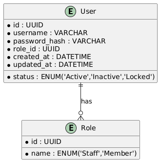

----
### 4.2.2. Bounded Context:Membership & Plans
#### 4.2.2.1. Domain Layer.
| Clase             | Tipo                       | Propósito                                                                 |
|-------------------|----------------------------|---------------------------------------------------------------------------|
| Member            | Aggregate Root (Entity)    | Representa un miembro del sistema, con sus datos personales, estado de membresía y historial de reservas o pagos. |
| Plan              | Entity                     | Define un plan o membresía, con duración, precio y características asociadas. |
| MembershipStatus  | Enum                       | Estados posibles de la membresía: Active, Expired, Cancelled, Pending.    |
| Subscription      | Entity / Value Object      | Representa la relación entre un miembro y un plan, incluyendo fechas de inicio y fin, renovaciones y cancelaciones. |

#### 4.2.2.2. Interface Layer.
| Clase                | Tipo                  | Propósito                                                                 |
|-----------------------|-----------------------|---------------------------------------------------------------------------|
| MemberController      | Controller            | Endpoints REST para crear, actualizar, eliminar y consultar miembros.     |
| PlanController        | Controller            | Endpoints REST para crear, actualizar, eliminar y consultar planes.       |
| MembershipMiddleware  | Middleware / Consumer | Valida el acceso del miembro según su plan activo antes de ejecutar operaciones sensibles. |

#### 4.2.2.3. Application Layer.
| Clase                       | Tipo                  | Propósito                                                                 |
|------------------------------|-----------------------|---------------------------------------------------------------------------|
| CreateMemberCommandHandler   | Command Handler       | Procesa la creación de un nuevo miembro.                                  |
| UpdateMemberCommandHandler   | Command Handler       | Actualiza información de un miembro existente.                            |
| DeleteMemberCommandHandler   | Command Handler       | Gestiona la eliminación o desactivación de un miembro.                     |
| CreatePlanCommandHandler     | Command Handler       | Permite crear un nuevo plan o membresía.                                  |
| UpdatePlanCommandHandler     | Command Handler       | Modifica un plan existente.                                               |
| DeletePlanCommandHandler     | Command Handler       | Elimina o desactiva un plan.                                              |
| ValidateMembershipHandler    | Command/Event Handler | Valida si un miembro puede acceder a funcionalidades según su plan activo.|

#### 4.2.2.4. Infrastructure Layer.
| Clase                   | Tipo                | Propósito                                                                  |
|--------------------------|---------------------|----------------------------------------------------------------------------|
| MemberRepository         | Repository Impl.    | Persistencia de miembros, operaciones CRUD y consultas por estado o ID.     |
| PlanRepository           | Repository Impl.    | Persistencia de planes, consultas por tipo, precio o duración.              |
| SubscriptionRepository   | Repository Impl.    | Gestiona la relación miembro-plan y operaciones de renovación/cancelación.  |
| DatabaseAdapter          | Adapter             | Implementa conexión a MySQL y operaciones de lectura/escritura.             |
#### 4.2.2.5. Bounded Context Software Architecture Component Level Diagrams.

#### 4.2.2.6. Bounded Context Software Architecture Code Level Diagrams.
##### 4.2.2.6.1. Bounded Context Domain Layer Class Diagrams.

##### 4.2.2.6.2. Bounded Context Database Design Diagram.


----
### 4.2.3. Bounded Context: Biometric Access Control
#### 4.2.3.1. Domain Layer.
| Clase      | Tipo    | Propósito                                                         |
|------------|---------|-------------------------------------------------------------------|
| Member     | Entity  | Representa al miembro registrado.                                 |
| Enrolment  | Entity  | Guarda plantilla de huella digital y fecha de enrolamiento.        |
| AccessLog  | Entity  | Registra eventos de acceso (MemberCheckedIn/MemberCheckedOut).     |
| AccessType | Enum    | Tipos de acceso posibles.                                         |

#### 4.2.3.2. Interface Layer.
| Clase                | Tipo       | Propósito                                                         |
|-----------------------|------------|-------------------------------------------------------------------|
| StaffPortalController | Controller | Exponer endpoints para enrolamiento y consulta de logs.           |
| AccessEventConsumer   | Consumer   | Escucha eventos de acceso generados por el IoT Gateway.           |

#### 4.2.3.3. Application Layer.
| Clase               | Tipo                  | Propósito                                                       |
|----------------------|-----------------------|-----------------------------------------------------------------|
| EnrolmentHandler     | Command/Event Handler | Gestiona enrolamiento de huellas.                               |
| AccessControlHandler | Command/Event Handler | Procesa eventos de acceso y actualiza logs.                     |

#### 4.2.3.4. Infrastructure Layer.
| Clase               | Tipo             | Propósito                                                       |
|----------------------|------------------|-----------------------------------------------------------------|
| BiometricRepository  | Repository Impl. | Persiste enrolamientos y logs de acceso.                        |
| IoTGatewayAdapter    | External Service | Interactúa con torniquetes y lectores biométricos.              |

#### 4.2.3.5. Bounded Context Software Architecture Component Level Diagrams.

#### 4.2.3.6. Bounded Context Software Architecture Code Level Diagrams.
##### 4.2.3.6.1. Bounded Context Domain Layer Class Diagrams.

##### 4.2.3.6.2. Bounded Context Database Design Diagram.


### 4.2.4. Bounded Context:Occupancy & Presence
#### 4.2.4.1. Domain Layer.
| Clase           | Tipo    | Propósito                                              |
|-----------------|---------|--------------------------------------------------------|
| Location        | Entity  | Representa áreas con capacidad máxima.                 |
| OccupancyRecord | Entity  | Mantiene conteo de ocupación en tiempo real.           |
| AccessEvent     | Entity  | Evento de entrada/salida de miembro.                   |
| AccessType      | Enum    | Tipos de acceso (MemberCheckedIn/MemberCheckedOut).    |

#### 4.2.4.2. Interface Layer.
| Clase                | Tipo       | Propósito                                           |
|-----------------------|------------|---------------------------------------------------|
| StaffPortalController | Controller | Consulta ocupación y alertas.                      |
| AccessEventConsumer   | Consumer   | Escucha eventos de Biometric Access o IoT Gateway. |

#### 4.2.4.3. Application Layer.
| Clase            | Tipo                  | Propósito                                                      |
|------------------|-----------------------|----------------------------------------------------------------|
| OccupancyHandler | Command/Event Handler | Calcula ocupación en tiempo real según eventos.                |
| OccupancyPolicy  | Policy                | Aplica reglas de capacidad máxima y alertas.                   |

#### 4.2.4.4. Infrastructure Layer.
| Clase               | Tipo             | Propósito                                         |
|----------------------|------------------|---------------------------------------------------|
| OccupancyRepository  | Repository Impl. | Persiste registros históricos de ocupación.       |
| IoTGatewayAdapter    | External Service | Recibe eventos de sensores de presencia.          |
#### 4.2.4.5. Bounded Context Software Architecture Component Level Diagrams.

#### 4.2.4.6. Bounded Context Software Architecture Code Level Diagrams.
##### 4.2.4.6.1. Bounded Context Domain Layer Class Diagrams.

##### 4.2.4.6.2. Bounded Context Database Design Diagram.

### 4.2.5. Bounded Context: IoT Edge Gateway
#### 4.2.5.1. Domain Layer.
| Clase       | Tipo   | Propósito                                                                 |
|-------------|--------|---------------------------------------------------------------------------|
| Sensor      | Entity | Representa un sensor conectado al gateway.                                |
| SensorEvent | Entity | Evento generado por un sensor.                                            |
| EventBuffer | Entity | Almacena eventos temporalmente en caso de desconexión.                    |
| SensorType  | Enum   | Tipos de sensor (Temperatura, Presión, Energía, Ocupación).               |
| SensorStatus| Enum   | Estado del sensor (Activo, Inactivo, Error).   
#### 4.2.5.2. Interface Layer.
| Clase             | Tipo      | Propósito                                                               |
|-------------------|-----------|-------------------------------------------------------------------------|
| IoTDeviceListener | Consumer  | Escucha datos provenientes de los sensores.                             |
| GatewayController | Controller| Permite monitoreo y gestión de dispositivos desde el monolito.          |

#### 4.2.5.3. Application Layer.
| Clase                | Tipo                  | Propósito                                                             |
|-----------------------|-----------------------|-----------------------------------------------------------------------|
| SensorDataHandler     | Command/Event Handler | Procesa datos recibidos de sensores.                                  |
| EventBufferHandler    | Policy                | Gestiona buffer temporal de eventos.                                  |
| EventPublisherHandler | Command/Event Handler | Publica eventos hacia los bounded contexts consumidores.               |

#### 4.2.5.4. Infrastructure Layer.
| Clase            | Tipo             | Propósito                                                              |
|------------------|------------------|------------------------------------------------------------------------|
| SensorRepository | Repository Impl. | Persiste datos históricos de sensores.                                 |
| IoTDeviceAdapter | External Service | Interactúa con dispositivos IoT para recibir datos.                     |
#### 4.2.5.5. Bounded Context Software Architecture Component Level Diagrams.

#### 4.2.5.6. Bounded Context Software Architecture Code Level Diagrams.
##### 4.2.5.6.1. Bounded Context Domain Layer Class Diagrams.

##### 4.2.5.6.2. Bounded Context Database Design Diagram.


# Capítulo V: Solution UI/UX Design

## 5.1. Style Guidelines.
En esta sección se definen las reglas visuales y de tono de comunicación de una marca o producto. El objetivo es asegurar que la presentación sea consistente en todos los lugares donde la marca aparece.
### 5.1.1. General Style Guidelines.
#### Logotipo
El logotipo de "Pump Up" se caracteriza por su diseño moderno y minimalista, donde la tipografía robusta transmite energía y dinamismo. Su simplicidad lo hace versátil y fácil de reconocer en distintas aplicaciones, desde la web hasta dispositivos móviles. El uso del color en el nombre le otorga un toque distintivo.

#### Paleta de Colores
La paleta de colores de "Pump Up" se construye sobre un contraste fuerte y moderno. El negro azulado oscuro (Deep Slate) proporciona una base sólida y sofisticada. El verde lima brillante (Electric Lime) actúa como el color de acento principal, transmitiendo energía y vitalidad, ideal para elementos interactivos y llamadas a la acción. Los tonos de gris (Cool Grey y Light Grey) complementan la paleta, ofreciendo neutralidad y legibilidad para el texto y los fondos secundarios.

#### Tipografía 
La tipografía utilizada en "Pump Up" es Inter. Esta fuente sans-serif ha sido elegida por su excelente legibilidad en pantallas y su diseño limpio y moderno. Es una tipografía versátil que se adapta bien tanto a títulos impactantes como a cuerpos de texto más largos, manteniendo la coherencia y profesionalismo en toda la interfaz. Su variedad de pesos permite establecer una clara jerarquía visual en la información, mejorando la experiencia del usuario.

#### Iconografía
La iconografía de "Pump Up" se inclina por un estilo lineal y minimalista, que complementa la estética moderna de la interfaz. Los iconos son claros, sencillos y fácilmente reconocibles, lo que facilita la navegación y la comprensión de las funciones. El uso de un color consistente (blanco o verde lima para estados activos) asegura que los iconos se integren armoniosamente con la paleta de colores general y destaquen cuando sea necesario.

### 5.1.2. Web, Mobile and IoT Style Guidelines.
#### Botones (Buttons)
**Campos de Entrada (Input Fields):** Los campos tienen un fondo ligeramente más claro que el fondo principal para delimitar claramente el área de escritura. El borde sutil se ilumina con el color verde de acento cuando el campo está activo (focus), proporcionando una retroalimentación visual inmediata y enfocando la atención del usuario en el campo que está editando.
**Etiquetas y Placeholders:** Las etiquetas (label) se sitúan fuera y encima del campo para que siempre sean visibles, mejorando la accesibilidad y usabilidad, especialmente en formularios largos. El texto de marcador de posición (placeholder) ofrece una pista sutil dentro del campo.
**Estados de Validación:** La comunicación del estado del formulario es vital. He diseñado estados claros de "Error" y "Éxito". El estado de error utiliza un color rojo para el borde y un ícono, una convención universalmente reconocida que alerta al usuario de manera inmediata. El estado de éxito utiliza el verde de acento para confirmar que la información es correcta, generando confianza.

#### Formularios (Forms)
**Campos de Entrada (Input Fields):** Los campos tienen un fondo ligeramente más claro que el fondo principal para delimitar claramente el área de escritura. El borde sutil se ilumina con el color verde de acento cuando el campo está activo (focus), proporcionando una retroalimentación visual inmediata y enfocando la atención del usuario en el campo que está editando.
**Etiquetas y Placeholders:** Las etiquetas (label) se sitúan fuera y encima del campo para que siempre sean visibles, mejorando la accesibilidad y usabilidad, especialmente en formularios largos. El texto de marcador de posición (placeholder) ofrece una pista sutil dentro del campo.
**Estados de Validación:** La comunicación del estado del formulario es vital. He diseñado estados claros de "Error" y "Éxito". El estado de error utiliza un color rojo para el borde y un ícono, una convención universalmente reconocida que alerta al usuario de manera inmediata. El estado de éxito utiliza el verde de acento para confirmar que la información es correcta, generando confianza.

#### Tarjetas (Cards)
**Estructura y Jerarquía:** La tarjeta utiliza un color de fondo similar al de la barra lateral de la imagen de referencia, creando una separación sutil pero efectiva del fondo principal de la aplicación. La información dentro de la tarjeta está estructurada con una jerarquía tipográfica clara: un título prominente, seguido de subtítulos o datos clave, y finalmente información secundaria con menor peso visual.
**Componentes Interactivos:** La tarjeta incorpora elementos como una imagen de perfil o avatar para una rápida identificación visual, una "etiqueta" o "chip" (ej. "Activo") que comunica un estado de forma rápida y visual, y botones de acción (siguiendo los estilos definidos previamente) para interactuar directamente con el contenido de la tarjeta, como "Ver Detalles" o "Editar". Esta composición hace que cada tarjeta funcione como una unidad de información autónoma y funcional.

##### Navegación (Navigation)
**Barra de Navegación Lateral (Sidebar):** Recreando el elemento principal de la imagen, la barra lateral es ideal para la navegación principal de la aplicación. Cada opción combina un ícono y texto para una rápida comprensión. El elemento activo se resalta claramente con un fondo de color diferente y una barra vertical en el color de acento verde. Esto proporciona una ubicación visual clara al usuario dentro de la estructura de la aplicación.
**Pestañas (Tabs):** Para la navegación secundaria dentro de una misma sección (por ejemplo, en la página de "Miembros", podríamos tener pestañas para "Todos", "Activos", "Inactivos"), he diseñado un sistema de pestañas. La pestaña activa se indica con un subrayado sólido en el color de acento, una solución minimalista y efectiva que no sobrecarga la interfaz. Las pestañas inactivas permanecen en un color neutro para indicar que son seleccionables pero no están activas.

## 5.2. Information Architecture.
## 5.2. Arquitectura de la Información (AI)

Para **PumpUp**, la Arquitectura de la Información es el esqueleto digital que soporta tanto el **Panel de Administrador** como la **Aplicación Móvil**. Es nuestro plano para organizar la gran cantidad de datos (miembros, pagos, check-ins, uso de equipos) de una manera que sea intuitiva y lógica. El objetivo es que un administrador pueda encontrar un reporte de aforo tan fácilmente como un miembro consulta su progreso de entrenamiento, sin necesidad de un manual de usuario.

---

## 5.2.1. Sistemas de Organización

Aquí definimos cómo se agruparán y presentarán los datos dentro de la plataforma. La organización se adaptará al contexto y a las necesidades de cada tipo de usuario (administradores vs. miembros).

#### Para el Panel de Administrador (Web)

El administrador necesita una visión macro y la capacidad de profundizar en los detalles. Su información se organizará principalmente por **esquemas temáticos y cronológicos**.

* **Gestión de Miembros:**
     **Esquema Exacto (Alfabético):** La vista principal y por defecto de la lista de miembros será un orden alfabético (A-Z) por apellido, permitiendo una búsqueda rápida y predecible.
     **Esquema Ambiguo/Temático (Por Estado):** Se ofrecerán filtros para agrupar a los miembros por su estado actual: **Activos**, **Inactivos**, **Pago Pendiente**, **Nuevos del Mes**. Esto es crucial para la gestión diaria y las acciones de retención.
     **Esquema Ambiguo/Temático (Por Plan):** También se podrán agrupar por el tipo de plan contratado (Ej: "Plan Ilimitado", "Plan Estudiante"), facilitando la segmentación para campañas de marketing o análisis de popularidad de los planes.

* **Control de Acceso y Actividad (Check-ins):**
     **Esquema Cronológico (Inverso):** El registro de actividad se mostrará como un *feed* en tiempo real, con la entrada más reciente en la parte superior. Esto permite al personal monitorear la actividad actual del gimnasio de un solo vistazo. Se podrá filtrar por fecha y hora para investigar incidentes o consultar datos históricos.

* **Uso de Equipos (IoT):**
     **Esquema Temático (Por Equipo):** Los datos se agruparán por cada máquina o equipo conectado. Al seleccionar un equipo (Ej: "Caminadora 3"), se podrá ver su historial de uso.
     **Esquema Cronológico:** Dentro de cada equipo, el historial de uso se ordenará por fecha y hora, permitiendo analizar patrones de uso y planificar mantenimientos.

* **Pagos y Finanzas:**
     **Esquema Cronológico:** El listado de transacciones se organizará por fecha de pago, de la más reciente a la más antigua.
     **Esquema Temático (Por Estado):** Se implementarán filtros clave como **Completados**, **Fallidos**, **Reembolsados**, para facilitar la contabilidad.

* **Reportes:**
     **Esquema por Audiencia/Temático:** Los reportes se categorizarán según su propósito para la toma de decisiones: **Reportes de Ocupación** (aforo, horas pico), **Reportes Financieros** (ingresos, planes más vendidos) y **Reportes de Miembros** (retención, nuevos registros).

#### Para la Aplicación Móvil (Miembros)

El miembro del gimnasio necesita una visión personal y centrada en su propio progreso y gestión. La organización será más simple y directa.

* **Pantalla de Inicio/Resumen:**
     **Esquema Temático:** Mostrará *widgets* o tarjetas con la información más relevante: un saludo, su próximo pago, su último entrenamiento y un acceso rápido para el check-in (NFC o QR).

* **Mi Progreso/Entrenamientos:**
     **Esquema Cronológico (Inverso):** El historial de sus entrenamientos y check-ins se mostrará del más reciente al más antiguo, permitiéndole ver su actividad reciente de forma inmediata.
     **Esquema Temático:** Se le permitirá filtrar sus entrenamientos por tipo de actividad o máquinas utilizadas para que pueda analizar su rendimiento en áreas específicas.

* **Mi Plan y Pagos:**
     **Esquema Temático y Cronológico:** Se mostrará prominentemente su plan **actual** y la fecha del próximo cobro. Debajo, un historial cronológico de todos sus pagos anteriores.

---

## 5.2.2. Sistemas de Etiquetado

La elección de las palabras correctas es fundamental para que la interfaz se sienta intuitiva y profesional. Usaremos un lenguaje consistente en toda la plataforma, evitando la jerga técnica. Las siguientes etiquetas serán el estándar para PumpUp.

 **Término Seleccionado: `Miembros`**
    > **Alternativas Descartadas:** Clientes, Usuarios, Atletas.
    > **Justificación:** **"Miembros"** fomenta un sentido de pertenencia y comunidad, que es un valor clave en el sector fitness. "Clientes" es demasiado transaccional y "Usuarios" es un término muy genérico del software.

 **Término Seleccionado: `Panel`**
    > **Alternativas Descartadas:** Dashboard, Inicio, Principal.
    > **Justificación:** **"Panel"** (o su sinónimo "Panel de Control") comunica claramente que es el centro de operaciones para el administrador, un lugar con herramientas, datos y controles, alineándose con la estética profesional de la plataforma.

 **Término Seleccionado: `Check-ins`**
    > **Alternativas Descartadas:** Control de Acceso, Entradas, Registros.
    > **Justificación:** **"Check-ins"** es un término moderno, corto y universalmente entendido en el contexto de gimnasios y eventos. "Control de Acceso" es el nombre técnico del proceso, pero no una etiqueta amigable para la interfaz.

 **Término Seleccionado: `Planes`**
    > **Alternativas Descartadas:** Membresías, Suscripciones, Tarifas.
    > **Justificación:** **"Planes"** es una palabra directa, concisa y flexible que engloba las diferentes ofertas que un gimnasio puede tener (Ej: Plan Mensual, Plan de 10 clases, Plan Familiar).

 **Término Seleccionado: `Equipos`**
    > **Alternativas Descartadas:** Máquinas, Activos.
    > **Justificación:** **"Equipos"** es un término más inclusivo que "Máquinas", ya que puede abarcar caminadoras, bicicletas, estaciones de pesas, racks y otros elementos monitoreados por IoT.

 **Término Seleccionado: `Reportes`**
    > **Alternativas Descartadas:** Analíticas, Estadísticas, Métricas.
    > **Justificación:** **"Reportes"** es una etiqueta orientada a la acción. Implica que el sistema ha procesado los datos para presentar conclusiones útiles para el negocio, que es el objetivo final de esta sección. "Analíticas" puede sonar demasiado complejo para algunos dueños de gimnasios.

 ---

## 5.2.3. SEO Tags y Meta Tags

En este apartado se define la estrategia de posicionamiento en buscadores (SEO) para el sitio web público de **PumpUp**. El objetivo es atraer a propietarios y administradores de gimnasios que buscan activamente soluciones para digitalizar y optimizar su gestión. El enfoque no está en los miembros del gimnasio, sino en los responsables de la toma de decisiones (B2B).

### Estrategia y Palabras Clave (Keywords)

Se ha definido un conjunto de palabras clave que abordan las necesidades y los "puntos de dolor" de nuestro público objetivo. Estas se dividen en categorías para cubrir diferentes intenciones de búsqueda.

* **Palabras Clave Principales (Core Keywords):** Son términos de búsqueda amplios con alto volumen.
    * `software para gimnasios`
    * `gestión de gimnasios`
    * `sistema para gimnasio`
    * `app para gimnasios`
    * `digitalización de gimnasios`

* **Palabras Clave Secundarias (Secondary Keywords):** Son términos más específicos que describen funcionalidades clave.
    * `control de acceso para gimnasio`
    * `gestión de miembros gimnasio`
    * `sistema de pagos para gimnasio`
    * `app móvil para miembros`
    * `tecnología IoT para fitness`
    * `control de aforo gimnasio`

* **Palabras Clave de Cola Larga (Long-Tail Keywords):** Frases específicas que indican una alta intención de compra o de resolver un problema concreto.
    * `cómo automatizar la gestión de mi gimnasio`
    * `mejor software para gimnasios pequeños`
    * `sistema con control biométrico para gimnasios`
    * `reducir carga administrativa en un gimnasio`
    * `plataforma para fidelizar miembros de gimnasio`

* **Palabras Clave Geolocalizadas (Geo-Targeted):** Para atraer clientes en mercados específicos. El [País/Ciudad] se reemplazará según la campaña.
    * `software para gimnasios en Perú`
    * `gestión de gimnasios en Lima`
    * `sistema para centros de entrenamiento en [Ciudad]`

### Definición de Meta Tags (Ejemplos por Página)

Los Meta Tags son el texto que aparece en los resultados de búsqueda de Google. Deben ser atractivos, contener la palabra clave principal de la página y motivar al clic.

#### Página de Inicio (Homepage)
 **Meta Título:**
    > PumpUp: Software de Gestión Todo-en-Uno para Gimnasios
 **Meta Descripción:**
    > Digitaliza y automatiza tu gimnasio con PumpUp. Control de acceso, app para miembros, gestión de pagos y reportes inteligentes. ¡Pide una demo!
#### Página de Funcionalidades
 **Meta Título:**
    > Control de Acceso, IoT y App para Miembros | Funcionalidades de PumpUp
 **Meta Descripción:**
    > Descubre cómo nuestro control de acceso biométrico, el seguimiento de equipos con IoT y la app personalizada para miembros revolucionarán tu gimnasio.
#### Página de Precios
 **Meta Título:**
    > Precios y Planes de PumpUp | Solución Escalable para tu Gimnasio
 **Meta Descripción:**
    > Encuentra el plan perfecto para tu gimnasio. Ofrecemos precios accesibles y modulares que se adaptan a tus necesidades. Sin contratos a largo plazo.
#### Página de Blog
 **Meta Título:**
    > Blog de PumpUp | Consejos de Gestión y Tecnología para Gimnasios
 **Meta Descripción:**
    > Artículos, guías y noticias sobre cómo mejorar la gestión de tu gimnasio, aumentar la retención de miembros y aplicar las últimas tecnologías del sector fitness.
#### Página de Contacto
 **Meta Título:**
    > Contacto | Habla con un Especialista de PumpUp
 **Meta Descripción:**
    > ¿Listo para llevar tu gimnasio al siguiente nivel? Contáctanos hoy mismo para solicitar una demostración personalizada o resolver tus dudas.
    
## 5.2.4. Sistemas de Búsqueda
El sistema de búsqueda de **PumpUp** está diseñado para ser el centro neurálgico de la navegación y el acceso a la información dentro del Panel de Administrador. Su objetivo es proporcionar respuestas instantáneas y precisas, reduciendo el tiempo que el personal del gimnasio invierte en encontrar datos de miembros, pagos o cualquier otro registro.
### Ubicación y Comportamiento del Campo de Búsqueda
 **Búsqueda Global:** La barra de búsqueda principal estará ubicada de forma prominente y persistente en la cabecera de la interfaz. Esto asegura que esté accesible desde cualquier sección del panel sin necesidad de navegar a una página específica para buscar.
 **Alcance:** La búsqueda será global, lo que significa que buscará coincidencias en las entidades más importantes de la plataforma simultáneamente: **Miembros**, **Pagos** y **Equipos**.
### Lógica de Búsqueda y Autocompletado (Live Search)
Para maximizar la eficiencia, la búsqueda no requerirá que el usuario presione "Enter". Los resultados aparecerán en tiempo real a medida que se escribe.
 **Autocompletado Inteligente:** Al empezar a escribir (después del segundo carácter), se desplegará un menú de autocompletado con los resultados más relevantes, categorizados para una fácil identificación.
 **Campos Indexados:** La búsqueda será potente y flexible, buscando en múltiples campos por cada entidad:
    * **Miembros:** Nombre, Apellido, Correo Electrónico, Número de Identificación o Código de Miembro.
    * **Pagos:** ID de Transacción, Nombre del Miembro asociado, Fecha.
    * **Equipos:** Nombre del Equipo (Ej: "Caminadora 3"), Tipo (Ej: "Cardio").
 **Acciones Rápidas:** El menú de autocompletado incluirá un enlace final de **"Ver todos los resultados..."** para dirigir al usuario a una página dedicada con la lista completa de coincidencias y opciones de filtrado avanzado.

### Página de Resultados de Búsqueda

Si el usuario necesita un análisis más profundo de los resultados, accederá a la página de resultados completa.

 **Visualización Clara:** Los resultados se mostrarán en formato de lista o tarjetas, destacando la información clave. El término de búsqueda aparecerá resaltado en cada resultado para una rápida identificación visual.
 **Filtros Avanzados y Contextuales:** El aspecto más importante de esta página será un panel lateral de filtros. Estos filtros cambiarán dinámicamente dependiendo de la categoría de resultados que se esté visualizando (si el usuario hace clic en la pestaña "Miembros", los filtros serán para miembros).
     **Filtros para Miembros:** Se podrá acotar la búsqueda por **Estado** (Activo, Inactivo), **Plan Contratado** (Ilimitado, Estudiante, etc.) y **Estado de Pago** (Al día, Pendiente).
     **Filtros para Pagos:** Se podrá filtrar por **Rango de Fechas**, **Estado del Pago** (Completado, Fallido) y **Método de Pago**.

     
### 5.2.5. Sistemas de Navegación

Los sistemas de navegación en **PumpUp** están diseñados para proporcionar una experiencia de usuario fluida y predecible, tanto para los administradores en el panel web como para los miembros en la aplicación móvil. La estructura jerárquica y el etiquetado consistente (definidos en secciones anteriores) guiarán a los usuarios a través de las diferentes funcionalidades de la plataforma.

#### Principios de Diseño de Navegación

* **Claridad:** Los ítems de navegación son concisos y representan claramente el contenido al que dirigen.
* **Consistencia:** La ubicación y el comportamiento de los elementos de navegación son uniformes en toda la plataforma.
* **Eficiencia:** El usuario puede acceder a la información o realizar una acción con el menor número de clics posible.
* **Retroalimentación:** El sistema siempre indica al usuario dónde se encuentra dentro de la estructura de navegación (ej. estado activo en menú lateral).

### Sistemas de Navegación Principales

#### 1. Navegación Global (Panel Web del Administrador)

* **Barra de Navegación Lateral Persistente:** Es el sistema de navegación primario, visible en todo momento. Contiene los enlaces a las secciones de nivel superior del panel.
    * `Panel` (Dashboard/Resumen)
    * `Miembros`
    * `Planes`
    * `Check-ins`
    * `Pagos`
    * `Equipos`
    * `Reportes`
    * `Configuración`
* **Búsqueda Global:** Complementa la navegación lateral permitiendo acceso directo a información específica sin recorrer la jerarquía.
* **Navegación de Usuario/Administrador:** Acceso a perfil de administrador, ajustes de cuenta y opción de cerrar sesión (ubicada en la parte superior derecha).

#### 2. Navegación Global (Aplicación Móvil para Miembros)

* **Barra de Navegación Inferior (Bottom Navigation Bar):** Es el sistema principal para la app móvil, ideal para un acceso rápido y con una mano a las secciones más usadas.
    * `Inicio` (Resumen personal, check-in rápido)
    * `Mi Progreso` (Historial de entrenamientos, métricas)
    * `Mi Plan` (Detalles de membresía, pagos)
    * `Perfil` (Ajustes personales, notificaciones)
* **Menú Lateral (Hamburger Menu) o Ajustes de Perfil:** Para acceder a opciones secundarias como "Configuración", "Ayuda", "Soporte", "Cerrar Sesión".

#### 3. Navegación Contextual

* **Pestañas (Tabs):** Se utilizan dentro de secciones específicas para organizar subcategorías de contenido (ej. en `Miembros`: `Todos`, `Activos`, `Inactivos`, `Pendientes`).
* **Breadcrumbs (Migas de Pan):** Aunque no siempre explícitamente visibles en el diseño oscuro minimalista, la estructura jerárquica permite al usuario comprender su ubicación en una ruta lógica (ej. Miembros > Ver Detalles de [Nombre Miembro]).
* **Enlaces de Acción/Internos:** Botones o enlaces dentro del contenido que dirigen a una acción o a otra sección relevante (ej. "Ver Detalles" en una tarjeta de miembro, "Pagar ahora" en la sección de planes).
#### Mapa del Sitio (Sitemap)
El siguiente diagrama muestra la jerarquía completa de las páginas y secciones principales de **PumpUp**, tanto para el Panel de Administrador como para la Aplicación Móvil, ilustrando cómo se relacionan entre sí.


## 5.3. Landing Page UI Design.
### 5.3.1. Wireframe de la Landing Page
La Landing Page de PumpUp es la primera impresión que los potenciales clientes (administradores y dueños de gimnasios) tendrán de nuestra solución. Su objetivo principal es **captar la atención, comunicar claramente el valor de PumpUp y convertir visitantes en leads** (solicitudes de demo o contacto). El diseño se centrará en la claridad, la persuasión y un llamado a la acción (CTA) prominente, manteniendo la estética profesional y moderna ya definida, aunque el wireframe será de baja fidelidad.
**Objetivos clave:**
1.  **Comunicar el Problema y la Solución:** Mostrar rápidamente cómo PumpUp resuelve los desafíos de la gestión de gimnasios.
2.  **Destacar Beneficios:** Enfatizar la automatización, la digitalización y la toma de decisiones basada en datos.
3.  **Generar Confianza:** Mostrar testimonios, logos de clientes o cifras relevantes (aunque no en este wireframe).
4.  **Conducir a la Conversión:** Un CTA claro y fácil de encontrar para solicitar una demo.


### 5.3.2. Mock-up de la Landing Page

El Mock-up de la Landing Page de **PumpUp** es la representación visual de alta fidelidad, aplicando los estilos y la estética previamente definidos (dark mode, color de acento verde, tipografías modernas y limpias). Este diseño "pixel-perfect" transformará el wireframe estructural en una experiencia visual atractiva y profesional, lista para ser desarrollada.

**Elementos Clave del Mock-up:**

* **Paleta de Colores:** Utilización del fondo oscuro (`#1E212B` / `navy blue` oscuro) como base, texto en blanco/gris claro para legibilidad y el verde vibrante (`#28A745`) para los elementos interactivos y de llamado a la acción, siguiendo la estética de la app.
* **Tipografía:** Fuentes sans-serif modernas y claras para todos los títulos y textos, manteniendo la coherencia con el panel de administración.
* **Imágenes e Íconos:** Se integrarán imágenes relevantes (como un dashboard del software o un diagrama de flujo) e íconos estilizados que refuercen los puntos clave de venta.
* **Componentes Reales:** Los botones, la barra de navegación y otros elementos replicarán los diseños propuestos en la sección 5.1.2. Pautas de Estilo.
* **Espaciado y Layout:** El diseño mantendrá un amplio espaciado para mejorar la legibilidad y la jerarquía visual, guiando al ojo del usuario a través del contenido de manera efectiva.

El objetivo de este mock-up es mostrar con precisión cómo se verá la Landing Page final, asegurando que la estética sea consistente y que la página sea altamente persuasiva para generar conversiones.


## 5.4. Applications UX/UI Design.
### 5.4.1. Applications Wireframes.
**Wireframe: Panel de Control (Dashboard del Administrador - Web)**
Este wireframe muestra la pantalla principal que verá el administrador al iniciar sesión. El diseño se centra en proporcionar una visión general rápida del estado del gimnasio. Incluye una barra de navegación lateral persistente, un área de búsqueda global superior y la sección central dividida en "widgets" o tarjetas de información clave: aforo actual, miembros activos, ingresos recientes y notificaciones importantes. Los gráficos sencillos indican tendencias sin sobrecargar al usuario.


**Wireframe: Lista de Miembros (Panel del Administrador - Web)**
Este wireframe presenta la pantalla donde el administrador puede visualizar y gestionar a todos los miembros del gimnasio. La barra de navegación lateral sigue presente. La parte superior incluye una barra de búsqueda específica para la sección de miembros y un botón para "Agregar Nuevo Miembro". El contenido principal muestra una tabla con los datos clave de los miembros (nombre, plan, estado, fecha de pago) y opciones de acción (editar, ver perfil). Los filtros por "Estado" y "Plan" se ubican prominentemente para facilitar la segmentación.


**Wireframe: Registro de Pagos (Panel del Administrador - Web)**
Esta pantalla proporciona una vista completa de todas las transacciones financieras del gimnasio. El diseño está pensado para que el administrador pueda auditar y rastrear los ingresos de manera eficiente. La interfaz incluye un filtro prominente por rango de fechas, un botón para registrar pagos manuales (ej. efectivo), y filtros adicionales por estado (completado, fallido, pendiente). La información se presenta en una tabla clara que detalla cada transacción, incluyendo el miembro, el monto, el estado y las acciones pertinentes como "Ver detalles" o "Generar recibo". La paginación en la parte inferior permite manejar un gran volumen de datos.


**Wireframe: Configuración (Panel del Administrador - Web)**
Esta pantalla centraliza todas las opciones de configuración de la plataforma para el administrador. Está diseñada para ser clara y fácil de navegar, agrupando las opciones por categorías lógicas mediante pestañas o un sub-menú lateral dentro de la propia sección de configuración. Las opciones incluyen la gestión del perfil del gimnasio (nombre, dirección), ajustes de pagos (integraciones, impuestos), gestión de usuarios administradores (roles, permisos), notificaciones y ajustes generales de la aplicación. Cada sub-sección contendría formularios sencillos con campos de entrada y botones para guardar los cambios, manteniendo la consistencia de los elementos UI definidos anteriormente.


### 5.4.2. Diagramas de Wireflow

Los Diagramas de Wireflow en **PumpUp** combinan la estructura visual de los wireframes con la lógica de un diagrama de flujo. Esto nos permite entender y comunicar cómo los usuarios (especialmente los administradores) se moverán a través de la aplicación para completar tareas específicas. Cada wireflow ilustrará la secuencia de pantallas y las acciones requeridas para alcanzar un objetivo, asegurando una experiencia de usuario lógica y eficiente.

**Propósito de los Wireflows:**
* **Visualizar Flujos Críticos:** Identificar y mapear los caminos más comunes que los usuarios tomarán en la aplicación.
* **Validar Interacciones:** Asegurar que las transiciones entre pantallas sean intuitivas y que los elementos de navegación funcionen como se espera.
* **Identificar Gaps:** Revelar posibles pasos faltantes o redundantes en el proceso.
* **Comunicación:** Servir como una herramienta clara para desarrolladores, diseñadores y stakeholders para entender la experiencia del usuario.


### 5.4.3. Mock-ups de las Aplicaciones

En esta etapa, se crea la representación visual final de cada pantalla clave de las aplicaciones de **PumpUp**. Partiendo de los wireframes de baja fidelidad, se integran todos los elementos de diseño: paleta de colores (tema oscuro con acentos verdes), tipografía, iconografía, espaciado y componentes de UI interactivos. El resultado son "mock-ups pixel-perfect" que reflejan la apariencia exacta de las aplicaciones antes de la fase de desarrollo.

**Elementos Integrados en los Mock-ups:**
* **Paleta de Colores:** Fondo oscuro (#1E212B), textos blancos/gris claro, acentos en verde vibrante (#28A745) para elementos activos y CTA.
* **Tipografía:** Uso consistente de la fuente sans-serif moderna elegida para asegurar legibilidad y coherencia.
* **Iconografía:** Implementación de íconos vectoriales claros y uniformes en estilo y tamaño.
* **Componentes de UI:** Botones, campos de formulario, tarjetas y elementos de navegación con el diseño final definido en las pautas de estilo.
* **Jerarquía Visual:** Aplicación de tamaño de fuente, peso, color y espaciado para guiar la atención del usuario a los elementos más importantes.

El objetivo es asegurar que cada pantalla no solo sea funcional sino también estéticamente atractiva, coherente con la marca PumpUp y optimizada para una excelente experiencia de usuario.


### 5.4.4. Diagramas de Flujo de Usuario

Los Diagramas de Flujo de Usuario en **PumpUp** sirven para mapear las interacciones de los usuarios con la aplicación de una manera más abstracta y centrada en la lógica de las decisiones. A diferencia de los wireflows (que muestran pantallas), estos diagramas ilustran las acciones del usuario, las decisiones del sistema y los posibles caminos alternativos para completar una tarea específica. Son cruciales para identificar puntos de fricción, optimizar la experiencia y asegurar que todos los escenarios posibles estén cubiertos.

**Componentes de un Diagrama de Flujo de Usuario:**
* **Puntos de Inicio/Fin (Terminal):** Indican el inicio o el final de un flujo.
* **Pasos (Proceso):** Representan una acción o un paso que el sistema o el usuario realiza.
* **Decisiones (Condición):** Bifurcaciones en el flujo donde el usuario o el sistema toma una decisión que lleva a diferentes caminos.
* **Conectores:** Flechas que indican la dirección del flujo.
* **Elementos de UI (Opcional):** Pueden incluirse referencias a pantallas o componentes específicos si son relevantes para el flujo.

A continuación, se presenta un Diagrama de Flujo de Usuario para una de las tareas más comunes de un miembro en la aplicación móvil: **"Renovar/Pagar Membresía"**. Este diagrama detallará el proceso desde que el miembro decide realizar el pago hasta su confirmación o gestión de errores.


## 5.5. Applications Prototyping.

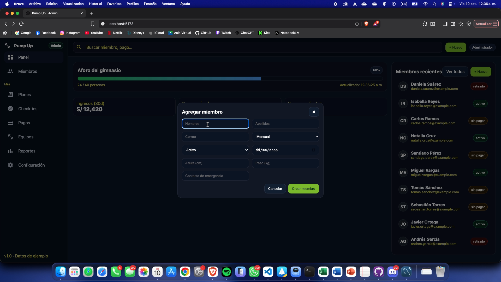

https://upcedupe-my.sharepoint.com/:v:/g/personal/u202015274_upc_edu_pe/EbLXYawk2ExOrcVFhCBEaNQBfKJ3_I4sB0EISeZWhXxz_g?nav=eyJyZWZlcnJhbEluZm8iOnsicmVmZXJyYWxBcHAiOiJPbmVEcml2ZUZvckJ1c2luZXNzIiwicmVmZXJyYWxBcHBQbGF0Zm9ybSI6IldlYiIsInJlZmVycmFsTW9kZSI6InZpZXciLCJyZWZlcnJhbFZpZXciOiJNeUZpbGVzTGlua0NvcHkifX0&e=ro5s0l


# Capítulo VI: Product Implementation, Validation & Deployment
## 6.1. Software Configuration Management.

En este punto, se explicará las decisiones y convenciones que el equipo utilizó para el desarrollo del projecto.

### 6.1.1. Software Development Environment Configuration.

**Project Management:**

Usamos la metodología SCRUM para el desarrollo y la gestión de nuestro proyecto, realizando reuniones de planificación y una revisión en retrospectiva.

**Product UX/UI Design:**

* **Figma:** Esta plataforma nos ayudo a diseñar y estructurar el diseño de nuestra Landing Page y aplicación web.

* **LucidChart:** Se utilizó esta herramienta para diagramar el EventStorming, además de los AS-IS ScenarioMapping

* **UXPressia:** Esta herramienta nos ayudó a realizar los User Persona, Emphaty Maps, Journey Maps e Impact Maps

**Software Development:**

* **Landing Page:** Se utilizó HTML, CSS y JavaScript para el desarrollo de la Landing Page implementando i18n.

* **Frontend Web Application:** Se utilizó React con Vite para el desarrollo de la interfaz, empleando Material UI para el diseño visual y Axios para la comunicación con el backend.

**Software Development:**

* **Software Documentation:** Se usó Github para la documentación y el control de versiones de la Landing Page y el Frontend Web Application.

### 6.1.2. Source Code Management.

* **Organización:** https://github.com/momentum-iot 
* **Repositorio Landing Page:** https://github.com/momentum-iot/PumpUp_Landing_Page
* **Repositorio Frontend Web Application:** https://github.com/momentum-iot/webApp
* **Repositorio Web Services:** https://github.com/momentum-iot/backEnd 
* **Repositorio Project Report:** https://github.com/momentum-iot/report

Para el desarrollo del proyecto, se utilizaron dos ramas principales `master` y `develop`.

Además, para el Project Report se creó una rama por cada punto detallado, por ejemplo las ramas `feature/interviews`, `feature/needfinding`, `feature/competitors`, `feature/lean-ux`, `feature/Strategic-Level-Domain-Driven-Design`

**Convenciones de Commits:**

Se hizo uso de **conventional commits** para la elaboración de este trabajo, asegurando la correcta comprensión y desarrollo de los cambios realizados. Haciendo uso de la siguiente estructura: 

`<tipo>(<ámbito>): <mensaje corto en presente>`

### 6.1.3. Source Code Style Guide & Conventions.

Para nuestro proyecto, el equipo adopta una nomenclatura en inglés y sigue las convenciones estándar de codificación según los lenguajes utilizados: HTML, CSS y JavaScript (React).

En HTML, se usa indentación de 2 espacios, etiquetas en minúsculas y atributos entre comillas dobles.  
Ejemplo:

```html
<section class="member-list">
  <h2>Active Members</h2>
</section>
```

En CSS, se sigue la metodología BEM (Block Element Modifier) para una estructura clara y escalable.  
Ejemplo:

```css
.card { ... }
.card__title { ... }
.card--highlighted { ... }
```

En JavaScript (React), los componentes se nombran en PascalCase, las funciones y variables en camelCase, y los archivos en kebab-case.  
Ejemplo:

```javascript
export default function MemberDetail() {
  const memberName = "Momentum";
  return <h1>{memberName}</h1>;
}
```

### 6.1.4. Software Deployment Configuration.
<h3>Landing</h3>
Para este producto realizamos el despliegue a través de GitHub Pages, la cual tiene un proceso de CI/CD integrado; cada que se realice un push o un merge a la rama configurada se hace un despliegue automático.

A continuación, se documentará el proceso y las configuraciones realizadas.

Primero, seleccionamos el repositorio y nos dirigimos a la pestaña Settings y luego a Pages. Dentro de esta sección, seleccionamos la rama principal (main o master) como la fuente para el despliegue y confirmamos la carpeta donde se encuentra el código de producción (generalmente /docs o la raíz del repositorio). Finalmente, guardamos los cambios y GitHub Pages se encarga de publicar el sitio.


<h3>Front</h3>
Para este producto utilizamos Netlify, la cual tiene un proceso de selección de proyectos que permite una configuración rápida y un despliegue continuo desde un repositorio de Git.


Luego, seleccionamos el proyecto del repositorio de Git que deseamos desplegar. Netlify detectará automáticamente el framework y nos sugerirá la configuración predeterminada. Establecemos el tipo de construcción, el comando de build (npm run build, por ejemplo) y la carpeta de publicación (dist o build).


Finalmente, tenemos el despliegue realizado, con un dominio en .netlify listo para ser consumido en cualquier parte del mundo y un flujo de CI/CD que asegura que cada cambio en el código se refleje automáticamente en el sitio en vivo.


## 6.2. Landing Page, Services & Applications Implementation.

### 6.2.1. Sprint 1

En esta sección especificaremos los aspectos principales del Sprint Planning Meeting. A continuación se coloca el cuadro de resumen del sprint
planning meeting:

#### 6.2.1.1. Sprint Planning 1.

<table cellspacing="0" cellpadding="6">
  <tr>
    <th>Sprint #</th>
    <td>Sprint 1</td>
  </tr>
  <tr>
    <th colspan="2">Sprint Planning Background</th>
  </tr>
  <tr>
    <th>Date</th>
    <td>2025-09-28</td>
  </tr>
  <tr>
    <th>Time</th>
    <td>12:00 PM</td>
  </tr>
  <tr>
    <th>Location</th>
    <td>Zoom Meetings</td>
  </tr>
  <tr>
    <th>Prepared By</th>
    <td>Del Castillo Bueno, Daniel Mateo</td>
  </tr>
  <tr>
    <th>Attendees (to planning meeting)</th>
    <td>Carlos Sanchez Montero, Gustavo Arturo Poma Espinoza, Leonardo Solis Solis, Alvaro Pinto Fuentes Rivera 
    </td>
  </tr>
  <tr>
    <th>Sprint 1 Review Summary</th>
    <td>No aplica por ser el primer sprint</td>
  </tr>
  <tr>
    <th>Sprint n – 1 Retrospective Summary</th>
    <td>No aplica por ser el primer sprint</td>
  </tr>
  <tr>
    <th colspan="2">Sprint Goal & User Stories</th>
  </tr>
  <tr>
    <th>Sprint 1 Goal</th>
    <td><b>Nuestro enfoque</b> está en entregar la primera version del Frontend Web Application, ademas de la versión final del Landing Page. <b>Creemos que</b> esto brinda seguridad en nuestros clientes.<b> Esto será confirmado cuando</b> los usuarios puedan acceder a visualizar nuestra primera versión.</td>
  </tr>
  <tr>
    <th>Sprint n Velocity</th>
    <td>32</td>
  </tr>
  <tr>
    <th>Sum of Story Points</th>
    <td>32</td>
  </tr>
</table>

#### 6.2.1.2. Aspect Leaders and Collaborators.

Los aspectos principales que se tomaron en cuenta fueron la creacion de la version final del landing page, el desarrollo de la primera version del frontend, y los principales aspectos del UX/UI Design.

<table cellspacing="0" cellpadding="6">
  <tr>
    <th>Team Member (Last Name, First Name)</th>
    <th>GitHub Username</th>
    <th>Creacion Landing Page<br>Leader (L) / Collaborator (C)</th>
    <th>Desarrollo Frontend<br>Leader (L) / Collaborator (C)</th>
    <th>UX/UI Design<br>Leader (L) / Collaborator (C)</th>
  </tr>
  <tr>
    <td>Del Castilo Bueno, Daniel Mateo</td>
    <td>teocchiii</td>
    <td>C</td>
    <td>L</td>
    <td>C</td>
  </tr>
  <tr>
    <td>Sanchez Montero Carlos</td>
    <td>carlossm907</td>
    <td>C</td>
    <td>L</td>
    <td>C</td>
  </tr>
  <tr>
    <td>Solis Solis, Leonardo</td>
    <td>CellBuuZer</td>
    <td>L</td>
    <td>C</td>
    <td>C</td>
  </tr>
  <tr>
    <td>Poma Espinoza, Gustavo Arturo</td>
    <td>GustavoPomaEspinoz</td>
    <td>C</td>
    <td>C</td>
    <td>L</td>
  </tr>
  <tr>
    <td>Pinto Fuentes, Alvaro</td>
    <td>AlvaroPFR</td>
    <td>L</td>
    <td>C</td>
    <td>C</td>
  </tr>
</table>

#### 6.2.1.3. Sprint Backlog 1.
<table cellspacing="0" cellpadding="6"> <thead> <tr> <th colspan="8">Sprint #1</th> </tr> <tr> <th colspan="2">User Story</th> <th colspan="6">Work-Item / Task</th> </tr> <tr> <th>Id</th> <th>Title</th> <th>Task Id</th> <th>Title</th> <th>Description</th> <th>Estimation (Hours)</th> <th>Assigned To</th> <th>Status</th> </tr> </thead> <tbody>
<!-- US30 -->
<tr>
  <td rowspan="2">US30</td>
  <td rowspan="2">Visualización de información en landing</td>
  <td>T30-1</td>
  <td>Diseñar sección de propuesta de valor</td>
  <td>Diseñar y maquetar la sección principal con la propuesta de valor destacada.</td>
  <td>8</td>
  <td>Poma Espinoza Gustavo Arturo</td>
  <td>In-Process</td>
</tr>
<tr>
  <td>T30-2</td>
  <td>Diseñar sección secundaria informativa</td>
  <td>Crear la sección adicional de servicios, beneficios o características relevantes.</td>
  <td>6</td>
  <td>Poma Espinoza Gustavo Arturo</td>
  <td>To-do</td>
</tr>

<!-- US31 -->
<tr>
  <td rowspan="2">US31</td>
  <td rowspan="2">Formulario de contacto</td>
  <td>T31-1</td>
  <td>Implementar formulario y validaciones</td>
  <td>Crear campos de nombre, correo y mensaje con validaciones.</td>
  <td>10</td>
  <td>Del Castillo Bueno Daniel Mateo</td>
  <td>To-do</td>
</tr>
<tr>
  <td>T31-2</td>
  <td>Integrar envío al backend</td>
  <td>Configurar endpoint, manejo de errores y confirmación de envío.</td>
  <td>5</td>
  <td>Del Castillo Bueno Daniel Mateo</td>
  <td>To-do</td>
</tr>

<!-- US32 -->
<tr>
  <td rowspan="2">US32</td>
  <td rowspan="2">Registro inicial desde la landing</td>
  <td>T32-1</td>
  <td>Desarrollar flujo de registro</td>
  <td>Crear formulario y conectar al backend.</td>
  <td>12</td>
  <td>Solis Solis Leonardo José</td>
  <td>In-Process</td>
</tr>
<tr>
  <td>T32-2</td>
  <td>Manejar validaciones y errores</td>
  <td>Implementar validación de credenciales, duplicados y manejo de rechazos.</td>
  <td>6</td>
  <td>Solis Solis Leonardo José</td>
  <td>To-do</td>
</tr>

<!-- US05 -->
<tr>
  <td rowspan="2">US05</td>
  <td rowspan="2">Consulta de estado del plan</td>
  <td>T05-1</td>
  <td>Crear interfaz de estado de membresía</td>
  <td>Mostrar plan vigente, fecha de expiración y avisos.</td>
  <td>9</td>
  <td>Sanchez Montero Carlos</td>
  <td>Done</td>
</tr>
<tr>
  <td>T05-2</td>
  <td>Integración con backend</td>
  <td>Consumir endpoint para traer estado real del plan.</td>
  <td>5</td>
  <td>Sanchez Montero Carlos</td>
  <td>Done</td>
</tr>

<!-- US10 -->
<tr>
  <td rowspan="2">US10</td>
  <td rowspan="2">Monitoreo de aforo por sede</td>
  <td>T10-1</td>
  <td>Implementar dashboard de aforo</td>
  <td>Crear panel visual con gráficos del aforo en tiempo real.</td>
  <td>11</td>
  <td>Pinto Fuentes Rivera Alvaro Felipe</td>
  <td>In-Process</td>
</tr>
<tr>
  <td>T10-2</td>
  <td>Conectar datos en tiempo real</td>
  <td>Integrar sockets o polling para actualizar el aforo.</td>
  <td>7</td>
  <td>Pinto Fuentes Rivera Alvaro Felipe</td>
  <td>To-do</td>
</tr>

<!-- US11 -->
<tr>
  <td rowspan="2">US11</td>
  <td rowspan="2">Alertas de sobreocupación</td>
  <td>T11-1</td>
  <td>Configurar sistema de notificaciones</td>
  <td>Crear lógica para enviar alertas cuando el límite sea superado.</td>
  <td>10</td>
  <td>Poma Espinoza Gustavo Arturo</td>
  <td>To-Review</td>
</tr>
<tr>
  <td>T11-2</td>
  <td>Configurar reglas y umbrales</td>
  <td>Definir niveles de alerta, límites y parámetros configurables.</td>
  <td>5</td>
  <td>Poma Espinoza Gustavo Arturo</td>
  <td>To-do</td>
</tr>

<!-- US12 -->
<tr>
  <td rowspan="2">US12</td>
  <td rowspan="2">Historial de visitas</td>
  <td>T12-1</td>
  <td>Construir módulo de historial</td>
  <td>Mostrar visitas ordenadas cronológicamente.</td>
  <td>9</td>
  <td>Del Castillo Bueno Daniel Mateo</td>
  <td>Done</td>
</tr>
<tr>
  <td>T12-2</td>
  <td>Integrar filtros</td>
  <td>Agregar filtros por rango de fechas y tipo de actividad.</td>
  <td>6</td>
  <td>Del Castillo Bueno Daniel Mateo</td>
  <td>Done</td>
</tr>

<!-- US20 -->
<tr>
  <td rowspan="2">US20</td>
  <td rowspan="2">Reporte de ocupación por periodo</td>
  <td>T20-1</td>
  <td>Desarrollar generación de reportes</td>
  <td>Generar datos de visitas, máximos y promedios.</td>
  <td>14</td>
  <td>Sanchez Montero Carlos</td>
  <td>In-Process</td>
</tr>
<tr>
  <td>T20-2</td>
  <td>Exportar reporte</td>
  <td>Permitir exportar en PDF o Excel.</td>
  <td>8</td>
  <td>Sanchez Montero Carlos</td>
  <td>To-do</td>
</tr>
</tbody> </table>

#### 6.2.1.4. Development Evidence for Sprint Review.

<table cellspacing="0" cellpadding="6">
  <thead>
    <tr>
      <th>Repository</th>
      <th>Branch</th>
      <th>Commit Id</th>
      <th>Commit Message</th>
      <th>Commit Message Body</th>
      <th>Commited on (Date)</th>
    </tr>
  </thead>
  <tbody>
    <tr>
      <td>momentum-iot/backEnd</td>
      <td>main</td>
      <td>c24df03</td>
      <td>chore: update gitignore</td>
      <td>Actualización del archivo .gitignore para excluir dependencias y archivos temporales innecesarios.</td>
      <td>Oct 9, 2025</td>
    </tr>
    <tr>
      <td>momentum-iot/backEnd</td>
      <td>main</td>
      <td>92665d1</td>
      <td>refactor: updated application.properties</td>
      <td>Refactorización del archivo application.properties para mejorar la configuración y la legibilidad del entorno.</td>
      <td>Oct 9, 2025</td>
    </tr>
    <tr>
      <td>momentum-iot/backEnd</td>
      <td>main</td>
      <td>53b1e99</td>
      <td>chore: added dotenv dependency</td>
      <td>Se añadió la dependencia dotenv para gestionar variables de entorno de manera más segura y eficiente.</td>
      <td>Oct 8, 2025</td>
    </tr>
    <tr>
      <td>momentum-iot/backEnd</td>
      <td>main</td>
      <td>9b16060</td>
      <td>chore: added .gitignore</td>
      <td>Se creó el archivo .gitignore para excluir carpetas de compilación y archivos locales del repositorio.</td>
      <td>Oct 8, 2025</td>
    </tr>
    <tr>
      <td>momentum-iot/backEnd</td>
      <td>main</td>
      <td>e2c3221</td>
      <td>chore: initial commit</td>
      <td>Commit inicial del proyecto con estructura base del backend configurada.</td>
      <td>Oct 8, 2025</td>
    </tr>
  </tbody>
</table>

<table cellspacing="0" cellpadding="6">
  <thead>
    <tr>
      <th>Repository</th>
      <th>Branch</th>
      <th>Commit Id</th>
      <th>Commit Message</th>
      <th>Commit Message Body</th>
      <th>Commited on (Date)</th>
    </tr>
  </thead>
  <tbody>
    <tr>
      <td>momentum-iot/webApp</td>
      <td>develop</td>
      <td>97a06c3</td>
      <td>style: webapp colors changed</td>
      <td>Se actualizaron los colores principales de la aplicación web para mejorar la consistencia visual y el contraste del tema.</td>
      <td>Oct 9, 2025</td>
    </tr>
    <tr>
      <td>momentum-iot/webApp</td>
      <td>develop</td>
      <td>50259a6</td>
      <td>feat(equipment): edit equipment added</td>
      <td>Se implementó la funcionalidad para editar los datos de los equipos desde la interfaz administrativa.</td>
      <td>Oct 9, 2025</td>
    </tr>
    <tr>
      <td>momentum-iot/webApp</td>
      <td>develop</td>
      <td>1f7265b</td>
      <td>style(equipmentdetail): buttons style changed</td>
      <td>Se mejoró el estilo y la disposición de los botones dentro del componente de detalle de equipos.</td>
      <td>Oct 9, 2025</td>
    </tr>
    <tr>
      <td>momentum-iot/webApp</td>
      <td>develop</td>
      <td>af7c8b9</td>
      <td>chore: added dependencies to the project</td>
      <td>Se añadieron las dependencias iniciales necesarias para la configuración del proyecto web.</td>
      <td>Oct 8, 2025</td>
    </tr>
    <tr>
      <td>momentum-iot/webApp</td>
      <td>develop</td>
      <td>fc34b6a</td>
      <td>chore: initial commit</td>
      <td>Commit inicial del proyecto con estructura base creada e inicialización del entorno de desarrollo.</td>
      <td>Oct 8, 2025</td>
    </tr>
  </tbody>
</table>

<table cellspacing="0" cellpadding="6">
  <thead>
    <tr>
      <th>Repository</th>
      <th>Branch</th>
      <th>Commit Id</th>
      <th>Commit Message</th>
      <th>Commit Message Body</th>
      <th>Commited on (Date)</th>
    </tr>
  </thead>
  <tbody>
    <tr>
      <td>momentum-iot/PumpUp_Landing_Page</td>
      <td>main</td>
      <td>4430ec7</td>
      <td>feat: colors updated</td>
      <td>Actualización de la paleta de colores para mejorar la coherencia visual y contraste en la landing page.</td>
      <td>Oct 9, 2025</td>
    </tr>
    <tr>
      <td>momentum-iot/PumpUp_Landing_Page</td>
      <td>main</td>
      <td>59036e8</td>
      <td>feat: styles updated</td>
      <td>Se refactorizaron los estilos CSS generales para optimizar la presentación y mejorar la experiencia del usuario.</td>
      <td>Oct 9, 2025</td>
    </tr>
    <tr>
      <td>momentum-iot/PumpUp_Landing_Page</td>
      <td>main</td>
      <td>5ea78ff</td>
      <td>feat: Added i18n and styles tweaks</td>
      <td>Se implementó la internacionalización (i18n) y se realizaron ajustes menores en los estilos visuales.</td>
      <td>Oct 6, 2025</td>
    </tr>
    <tr>
      <td>momentum-iot/PumpUp_Landing_Page</td>
      <td>main</td>
      <td>d604c2d</td>
      <td>chore: initial commit</td>
      <td>Commit inicial del proyecto con estructura base de la landing page y configuración inicial.</td>
      <td>Oct 4, 2025</td>
    </tr>
  </tbody>
</table>

Enlace a Github: https://github.com/orgs/momentum-iot/repositories

#### 6.2.1.5. Testing Suite Evidence for Sprint Review.

El test MemberControllerIntegrationTest verifica el correcto funcionamiento del controlador de miembros mediante solicitudes HTTP simuladas. Comprueba que los endpoints del API respondan adecuadamente en las operaciones principales (listar, obtener, crear, actualizar y eliminar miembros), así como en la consulta de pagos y check-ins, garantizando que el flujo completo de la gestión de miembros funcione correctamente dentro del contexto real de la aplicación Spring Boot.

```java

@SpringBootTest
@AutoConfigureMockMvc
class MemberControllerIntegrationTest {

    @Autowired
    private MockMvc mockMvc;

    @Autowired
    private MemberService memberService;

    @Autowired
    private PaymentRepo paymentRepo;

    @Autowired
    private CheckInRepo checkInRepo;

    private Member createdMember;

    @BeforeEach
    void setup() {
        // Limpieza previa de registros
        memberService.list().forEach(m -> memberService.delete(m.getId()));

        // Crear miembro base
        Member m = new Member();
        m.setFirstName("Carlos");
        m.setLastName("Sánchez");
        m.setEmail("carlos@example.com");
        m.setMembership("Gold");
        m.setStatus("activo");
        m.setPhone("999999999");
        createdMember = memberService.save(m);
    }

    @Test
    void shouldListMembers() throws Exception {
        mockMvc.perform(get("/api/members"))
                .andExpect(status().isOk())
                .andExpect(jsonPath("$", not(empty())));
    }

    @Test
    void shouldGetMemberById() throws Exception {
        mockMvc.perform(get("/api/members/" + createdMember.getId()))
                .andExpect(status().isOk())
                .andExpect(jsonPath("$.email", is("carlos@example.com")))
                .andExpect(jsonPath("$.firstName", is("Carlos")));
    }

    @Test
    void shouldCreateMember() throws Exception {
        String json = """
            {
              "firstName": "Nuevo",
              "lastName": "Miembro",
              "email": "nuevo@example.com",
              "membership": "Silver",
              "status": "activo",
              "phone": "988888888"
            }
        """;

        mockMvc.perform(post("/api/members")
                .contentType(MediaType.APPLICATION_JSON)
                .content(json))
                .andExpect(status().isOk())
                .andExpect(jsonPath("$.firstName", is("Nuevo")))
                .andExpect(jsonPath("$.membership", is("Silver")));
    }

    @Test
    void shouldUpdateMember() throws Exception {
        String json = """
            {
              "firstName": "Carlos",
              "lastName": "Actualizado",
              "email": "carlos@example.com",
              "membership": "Gold",
              "status": "activo",
              "phone": "999999999"
            }
        """;

        mockMvc.perform(put("/api/members/" + createdMember.getId())
                .contentType(MediaType.APPLICATION_JSON)
                .content(json))
                .andExpect(status().isOk())
                .andExpect(jsonPath("$.lastName", is("Actualizado")));
    }

    @Test
    void shouldDeleteMember() throws Exception {
        mockMvc.perform(delete("/api/members/" + createdMember.getId()))
                .andExpect(status().isNoContent());
    }

    @Test
    void shouldReturnPaymentsForMember() throws Exception {
        mockMvc.perform(get("/api/members/" + createdMember.getId() + "/payments"))
                .andExpect(status().isOk());
    }

    @Test
    void shouldReturnCheckinsForMember() throws Exception {
        mockMvc.perform(get("/api/members/" + createdMember.getId() + "/checkins"))
                .andExpect(status().isOk());
    }
}
```

#### 6.2.1.6. Execution Evidence for Sprint Review.
* **Landing Page:**
Video demostración Landing Page: https://upcedupe-my.sharepoint.com/:v:/g/personal/u202015274_upc_edu_pe/ERT6dAIFQIVDmbtbXNAKYIAB6XhpW1-fV0tRgiuG-aedfQ?nav=eyJyZWZlcnJhbEluZm8iOnsicmVmZXJyYWxBcHAiOiJPbmVEcml2ZUZvckJ1c2luZXNzIiwicmVmZXJyYWxBcHBQbGF0Zm9ybSI6IldlYiIsInJlZmVycmFsTW9kZSI6InZpZXciLCJyZWZlcnJhbFZpZXciOiJNeUZpbGVzTGlua0NvcHkifX0&e=Qnzt0L
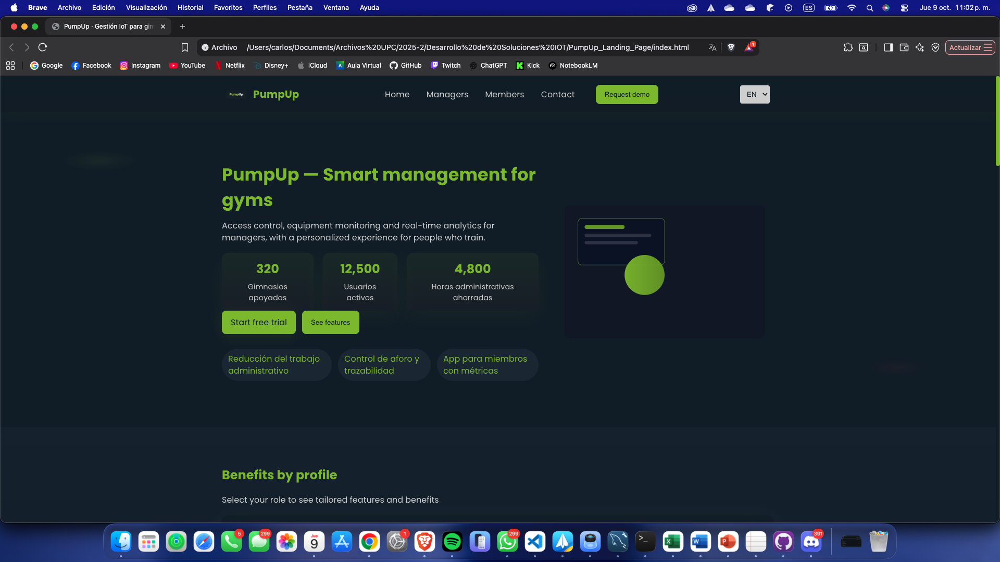

* **Frontend Web Application:**
Video Demostración Frontend: https://upcedupe-my.sharepoint.com/:v:/g/personal/u202015274_upc_edu_pe/EXf98cFeMeVDqmc87M_RT8MBeT10xY6wftWNMz9gfHKOBA?nav=eyJyZWZlcnJhbEluZm8iOnsicmVmZXJyYWxBcHAiOiJPbmVEcml2ZUZvckJ1c2luZXNzIiwicmVmZXJyYWxBcHBQbGF0Zm9ybSI6IldlYiIsInJlZmVycmFsTW9kZSI6InZpZXciLCJyZWZlcnJhbFZpZXciOiJNeUZpbGVzTGlua0NvcHkifX0&e=QduhOb 
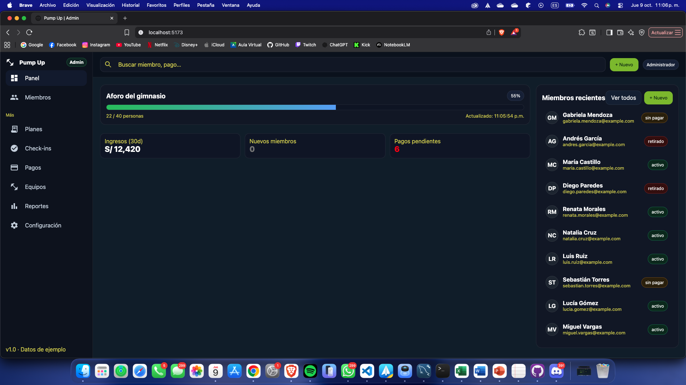

* **Frontend Web Service:**
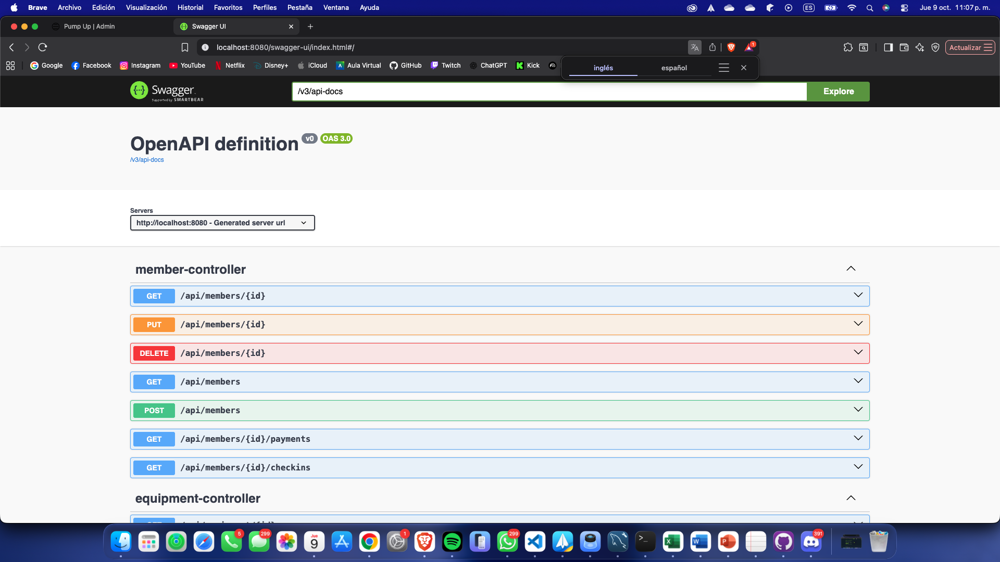

#### 6.2.1.7. Services Documentation Evidence for Sprint Review.

| **Endpoint** | **Acción** | **Verbo HTTP** | **Parámetros / Request Body** | **Ejemplo** |
|---------------|-------------|----------------|--------------------------------|--------------|
| `/api/checkins` | Registrar un nuevo check-in | **POST** | ```json { "memberId": "string", "checkInTime": "2025-10-09T18:30:00Z" } ``` | ```json { "memberId": "cld123abc", "checkInTime": "2025-10-09T18:30:00Z" } ``` |
| `/api/checkins` | Obtener todos los check-ins | **GET** | N/A | ```json [ { "id": "chk-01", "memberId": "mem-001", "checkInTime": "2025-10-09T18:30:00Z" } ] ``` |
| `/api/plans` | Obtener lista de planes disponibles | **GET** | N/A | ```json [ { "id": "plan-001", "name": "Mensual", "price": 120, "durationDays": 30 } ] ``` |
| `/api/payments` | Consultar pagos registrados | **GET** | N/A | ```json [ { "id": "pay-001", "memberId": "mem-001", "amount": 120.00, "date": "2025-10-01" } ] ``` |
| `/api/occupancy` | Obtener estado actual del aforo | **GET** | N/A | ```json { "currentOccupancy": 35, "maxCapacity": 50, "percentage": 70 } ``` |
| `/api/health` | Verificar estado de salud del sistema | **GET** | N/A | ```json { "status": "UP", "timestamp": "2025-10-09T23:00:00Z" } ``` |
| `/api/members` | Registrar un nuevo miembro | **POST** | ```json { "firstName": "string", "lastName": "string", "email": "string", "membershipType": "string" } ``` | ```json { "firstName": "Carlos", "lastName": "Sánchez", "email": "carlos@example.com", "membershipType": "Premium" } ``` |
| `/api/members/{id}` | Obtener información de un miembro | **GET** | Path param: `id` (string) | ```json { "id": "mem-001", "firstName": "Carlos", "email": "carlos@example.com" } ``` |
| `/api/members/{id}` | Actualizar datos de un miembro | **PUT** | ```json { "firstName": "string", "lastName": "string", "membershipType": "string" } ``` | ```json { "firstName": "Carlos", "lastName": "Sánchez Montero", "membershipType": "VIP" } ``` |
| `/api/members/{id}` | Eliminar un miembro | **DELETE** | Path param: `id` (string) | ```json { "message": "Miembro eliminado correctamente" } ``` |
| `/api/members/{id}/payments` | Obtener pagos asociados a un miembro | **GET** | Path param: `id` (string) | ```json [ { "paymentId": "pay-001", "amount": 120.00, "date": "2025-10-01" } ] ``` |
| `/api/members/{id}/checkins` | Obtener check-ins de un miembro | **GET** | Path param: `id` (string) | ```json [ { "checkInId": "chk-001", "checkInTime": "2025-10-09T18:30:00Z" } ] ``` |
| `/api/equipment` | Registrar nuevo equipo | **POST** | ```json { "name": "string", "category": "string", "status": "Available" } ``` | ```json { "name": "Treadmill Pro", "category": "Cardio", "status": "Available" } ``` |
| `/api/equipment` | Listar todos los equipos | **GET** | N/A | ```json [ { "id": "eq-001", "name": "Treadmill Pro", "status": "Available" } ] ``` |
| `/api/equipment/{id}` | Obtener detalles de un equipo | **GET** | Path param: `id` (string) | ```json { "id": "eq-001", "name": "Treadmill Pro", "category": "Cardio", "status": "Available" } ``` |
| `/api/equipment/{id}` | Actualizar información del equipo | **PUT** | ```json { "name": "string", "status": "string" } ``` | ```json { "name": "Bench Press", "status": "In Maintenance" } ``` |
| `/api/equipment/{id}` | Eliminar equipo | **DELETE** | Path param: `id` (string) | ```json { "message": "Equipo eliminado correctamente" } ``` |

#### 6.2.1.8. Software Deployment Evidence for Sprint Review.
La landing page desplegada se encuentra en el siguiente enlace:
[LANDING PAGE](https://momentum-iot.github.io/PumpUp_Landing_Page/)

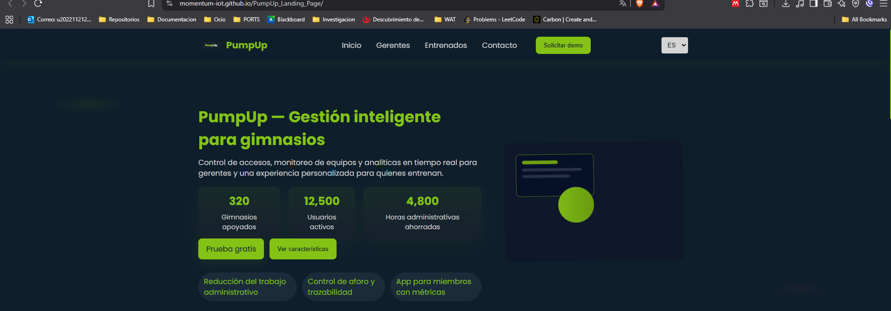

La aplicacion web se encuentra desplegada en el siguiente enlace:
[WEB APP](https://pumpup.netlify.app/)

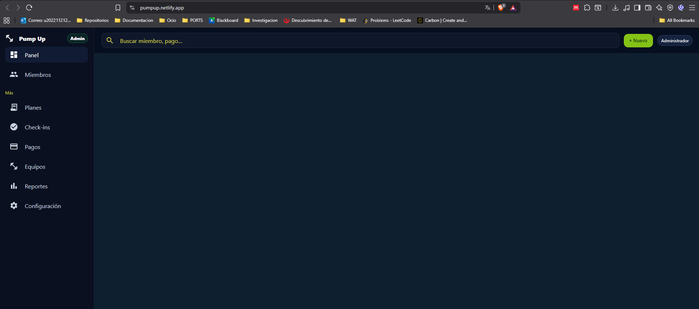
#### 6.2.1.9. Team Collaboration Insights during Sprint.
* **Frontend Web Application:**
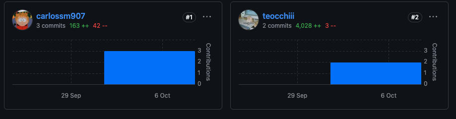

* **Landing Page:**
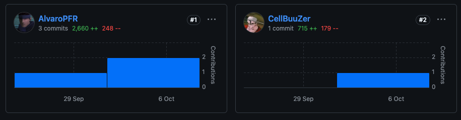

* **Project Report:**
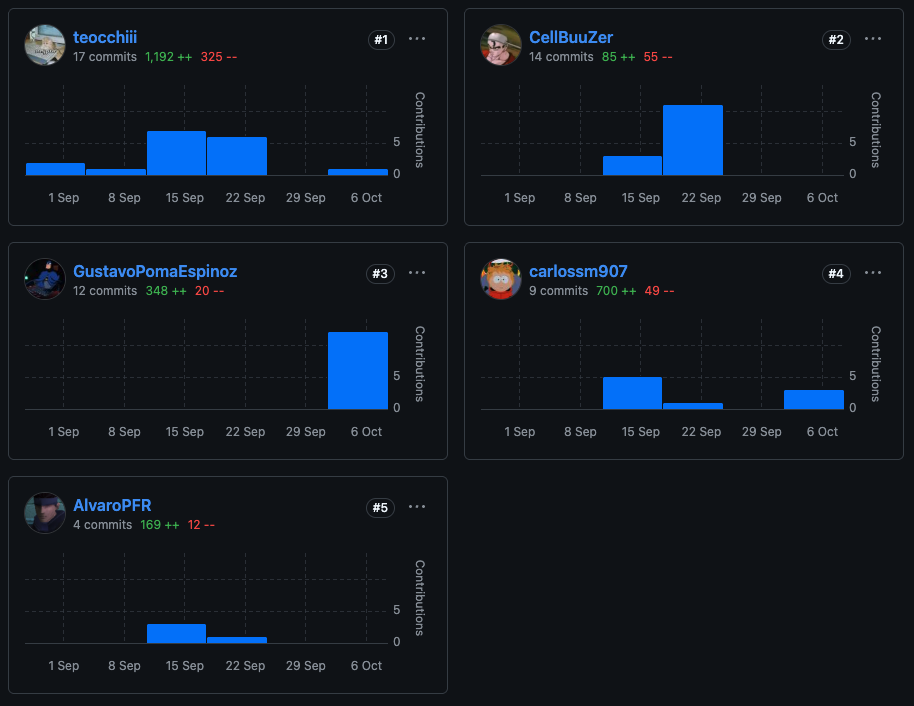

### 6.2.2. Sprint 2
#### 6.2.2.1. Sprint Planning 2.
#### 6.2.2.2. Aspect Leaders and Collaborators.
#### 6.2.2.3. Sprint Backlog 2.
<table cellspacing="0" cellpadding="6"> <thead> <tr> <th colspan="8">Sprint #1</th> </tr> <tr> <th colspan="2">User Story</th> <th colspan="6">Work-Item / Task</th> </tr> <tr> <th>Id</th> <th>Title</th> <th>Id</th> <th>Title</th> <th>Description</th> <th>Estimation (Hours)</th> <th>Assigned To</th> <th>Status (To-do / In-Process / To-Review / Done)</th> </tr> </thead> <tbody>
<!-- US01 -->
<tr>
  <td>US01</td>
  <td>Acceso con huella biométrica</td>
  <td>TASK01</td>
  <td>Implementar validación de huella</td>
  <td>Crear módulo que valide la huella enrolada del usuario al ingresar.</td>
  <td>8</td>
  <td>—</td>
  <td>To-do</td>
</tr>
<tr>
  <td>US01</td>
  <td>Acceso con huella biométrica</td>
  <td>TASK02</td>
  <td>Registrar intentos fallidos</td>
  <td>Guardar en bitácora cada intento fallido de acceso por huella.</td>
  <td>6</td>
  <td>—</td>
  <td>To-do</td>
</tr>

<!-- US02 -->
<tr>
  <td>US02</td>
  <td>Registro de entrada y salida</td>
  <td>TASK03</td>
  <td>Registrar ingreso</td>
  <td>Implementar registro de hora de entrada del usuario.</td>
  <td>7</td>
  <td>—</td>
  <td>To-do</td>
</tr>
<tr>
  <td>US02</td>
  <td>Registro de entrada y salida</td>
  <td>TASK04</td>
  <td>Registrar salida</td>
  <td>Guardar hora de salida y actualizar el historial del usuario.</td>
  <td>6</td>
  <td>—</td>
  <td>To-do</td>
</tr>

<!-- US03 -->
<tr>
  <td>US03</td>
  <td>Bloqueo de acceso</td>
  <td>TASK05</td>
  <td>Verificación de estado del plan</td>
  <td>Validar si el plan está vencido antes de permitir ingreso.</td>
  <td>7</td>
  <td>—</td>
  <td>To-do</td>
</tr>
<tr>
  <td>US03</td>
  <td>Bloqueo de acceso</td>
  <td>TASK06</td>
  <td>Registro de bloqueos</td>
  <td>Registrar intentos de acceso cuando el plan está vencido.</td>
  <td>5</td>
  <td>—</td>
  <td>To-do</td>
</tr>

<!-- US04 -->
<tr>
  <td>US04</td>
  <td>Acceso con tarjeta NFC</td>
  <td>TASK07</td>
  <td>Validación de tarjeta</td>
  <td>Verificar si la tarjeta NFC está asociada a un usuario activo.</td>
  <td>7</td>
  <td>—</td>
  <td>To-do</td>
</tr>
<tr>
  <td>US04</td>
  <td>Acceso con tarjeta NFC</td>
  <td>TASK08</td>
  <td>Registro de intentos fallidos</td>
  <td>Almacenar intentos de acceso con tarjetas no registradas.</td>
  <td>5</td>
  <td>—</td>
  <td>To-do</td>
</tr>

<!-- US05 -->
<tr>
  <td>US05</td>
  <td>Consulta de estado del plan</td>
  <td>TASK09</td>
  <td>Implementar consulta de membresía</td>
  <td>Mostrar estado vigente, vencido o próximo a vencer.</td>
  <td>8</td>
  <td>—</td>
  <td>To-do</td>
</tr>
<tr>
  <td>US05</td>
  <td>Consulta de estado del plan</td>
  <td>TASK10</td>
  <td>Cálculo de vigencia</td>
  <td>Implementar lógica de fechas para determinar vigencia actual.</td>
  <td>6</td>
  <td>—</td>
  <td>To-do</td>
</tr>

<!-- US06 -->
<tr>
  <td>US06</td>
  <td>Renovación de membresía</td>
  <td>TASK11</td>
  <td>Registrar renovación</td>
  <td>Guardar nueva vigencia al renovar el plan.</td>
  <td>8</td>
  <td>—</td>
  <td>To-do</td>
</tr>
<tr>
  <td>US06</td>
  <td>Renovación de membresía</td>
  <td>TASK12</td>
  <td>Actualizar fechas</td>
  <td>Actualizar fechas y estado del miembro tras la renovación.</td>
  <td>5</td>
  <td>—</td>
  <td>To-do</td>
</tr>

<!-- US07 -->
<tr>
  <td>US07</td>
  <td>Suspensión de membresía</td>
  <td>TASK13</td>
  <td>Implementar suspensión</td>
  <td>Cambiar estado del miembro a suspendido temporalmente.</td>
  <td>7</td>
  <td>—</td>
  <td>To-do</td>
</tr>
<tr>
  <td>US07</td>
  <td>Suspensión de membresía</td>
  <td>TASK14</td>
  <td>Registrar evento de suspensión</td>
  <td>Guardar bitácora con la razón y fechas de suspensión.</td>
  <td>4</td>
  <td>—</td>
  <td>To-do</td>
</tr>

<!-- US08 -->
<tr>
  <td>US08</td>
  <td>Validación de acceso por plan</td>
  <td>TASK15</td>
  <td>Implementar validación</td>
  <td>Verificar si el plan está vigente al intentar ingresar.</td>
  <td>8</td>
  <td>—</td>
  <td>To-do</td>
</tr>
<tr>
  <td>US08</td>
  <td>Validación de acceso por plan</td>
  <td>TASK16</td>
  <td>Manejo de rechazo</td>
  <td>Enviar respuesta indicando motivo del rechazo.</td>
  <td>4</td>
  <td>—</td>
  <td>To-do</td>
</tr>

<!-- US09 -->
<tr>
  <td>US09</td>
  <td>Consulta de aforo actual</td>
  <td>TASK17</td>
  <td>Obtener aforo actual</td>
  <td>Consultar número de usuarios dentro de la sede.</td>
  <td>7</td>
  <td>—</td>
  <td>To-do</td>
</tr>
<tr>
  <td>US09</td>
  <td>Consulta de aforo actual</td>
  <td>TASK18</td>
  <td>Mostrar porcentaje de ocupación</td>
  <td>Calcular y presentar porcentaje total de aforo usado.</td>
  <td>5</td>
  <td>—</td>
  <td>To-do</td>
</tr>

<!-- US10 -->
<tr>
  <td>US10</td>
  <td>Monitoreo de aforo por sede</td>
  <td>TASK19</td>
  <td>Implementar dashboard por sede</td>
  <td>Crear panel de visualización del aforo agrupado por sede.</td>
  <td>9</td>
  <td>—</td>
  <td>To-do</td>
</tr>
<tr>
  <td>US10</td>
  <td>Monitoreo de aforo por sede</td>
  <td>TASK20</td>
  <td>Mostrar usuarios activos</td>
  <td>Mostrar número exacto de usuarios presentes.</td>
  <td>6</td>
  <td>—</td>
  <td>To-do</td>
</tr>

<!-- US11 -->
<tr>
  <td>US11</td>
  <td>Alertas de sobreocupación</td>
  <td>TASK21</td>
  <td>Configurar umbrales</td>
  <td>Crear lógica que detecte si el aforo supera el límite.</td>
  <td>8</td>
  <td>—</td>
  <td>To-do</td>
</tr>
<tr>
  <td>US11</td>
  <td>Alertas de sobreocupación</td>
  <td>TASK22</td>
  <td>Enviar notificaciones</td>
  <td>Notificar a administradores cuando se supere el aforo máximo.</td>
  <td>6</td>
  <td>—</td>
  <td>To-do</td>
</tr>

<!-- US12 -->
<tr>
  <td>US12</td>
  <td>Historial de visitas</td>
  <td>TASK23</td>
  <td>Construir módulo de historial</td>
  <td>Implementar lista cronológica de entradas y salidas.</td>
  <td>8</td>
  <td>—</td>
  <td>To-do</td>
</tr>
<tr>
  <td>US12</td>
  <td>Historial de visitas</td>
  <td>TASK24</td>
  <td>Ordenar registros</td>
  <td>Ordenar los datos según timestamp más reciente.</td>
  <td>5</td>
  <td>—</td>
  <td>To-do</td>
</tr>

<!-- US20 -->
<tr>
  <td>US20</td>
  <td>Generar reporte de ocupación por periodo</td>
  <td>TASK25</td>
  <td>Crear generador de reportes</td>
  <td>Generar datos de ocupación por fecha y sede.</td>
  <td>9</td>
  <td>—</td>
  <td>To-do</td>
</tr>
<tr>
  <td>US20</td>
  <td>Generar reporte de ocupación por periodo</td>
  <td>TASK26</td>
  <td>Formatear reporte final</td>
  <td>Calcular total, máximo y promedio del periodo.</td>
  <td>7</td>
  <td>—</td>
  <td>To-do</td>
</tr>
</tbody> </table>

#### 6.2.2.4. Development Evidence for Sprint Review.

#### 6.2.2.5. Testing Suite Evidence for Sprint Review.

#### 6.2.2.6. Execution Evidence for Sprint Review.

#### 6.2.2.7. Services Documentation Evidence for Sprint Review.
#### 6.2.2.8. Software Deployment Evidence for Sprint Review.
#### 6.2.2.9. Team Collaboration Insights during Sprint.
## 6.3. Validation Interviews.
### 6.3.1. Diseño de Entrevistas.
**Preguntas generales:**

1. ¿Cuál es su nombre? 
2. ¿Qué edad tiene? 
3. ¿A qué se dedica? 
4. ¿[Opinion de idea de propuesta]? 

**Entrevistas usuario segmento 2**
1. ¿Lorem?
2. ¿Lorem?
3. ¿Lorem?
4. ¿Lorem?  
   
**Entrevistas usuario segmento 2**
1. ¿Lorem? 
2. ¿Lorem?
3. ¿Lorem?
4. ¿Lorem? 
### 6.3.2. Registro de Entrevistas.
**Segmento 1**  
Nombre: _____
Edad: _ años 
Ocupación: _____  
  
{texto mucho}

**Segmento 2**  
Nombre: _____
Edad: _ años 
Ocupación: _____  

{texto}
### 6.3.3. Evaluaciones según heurísticas.
| HEURÍSTICA   | EVALUACIÓN | NOTA      |
| --------------------------------------------- | ---------- | --------- |
| Visibilidad del estado del sistema            |            | {texto}   |
| Coincidencia entre el sistema y el mundo real |            | {texto}   |
| Control y libertad del usuario                |            | {texto}   |
| Consistencia y estándares                     |            | {texto}   |
| Prevención de errores                         |            | {texto}   |
| Mostrar antes que recordar                    |            | {texto}   |
| Flexibilidad y eficiencia de uso              |            | {texto}   |
| Diseño estético y minimalista                 |            | {texto}   |
| Comunicar errores con facilidad               |            | {texto}   |
| Ayuda y documentación                         |            | {texto}   |
## 6.4. Video About-the-Product.
[URL del video about the product](https://www.example.com)
# Conclusiones
<h2>TB1</h2>

1. La arquitectura definida permitió organizar el sistema en dominios y módulos claros, favoreciendo la modularidad y la integración con servicios externos sin comprometer la coherencia del monolito planteado.

2. El alcance del proyecto se centró en equilibrar la experiencia de usuario, representada principalmente en la landing page, con el desarrollo de procesos internos como la gestión de planes, reservas y pagos, asegurando valor tanto para los usuarios finales como para la operación del sistema.

3. La gestión del backlog permitió mantener un control ordenado de las 42 historias de usuario, priorizando las relacionadas a la landing page y asignando esfuerzos realistas a cada tarea, lo que facilita la ejecución de sprints y el seguimiento del avance del proyecto.
<h2>TP</h2>

1. El trabajo práctico permitió consolidar la arquitectura visual y funcional del sistema, traduciendo los lineamientos de diseño en componentes reutilizables y coherentes dentro del ecosistema React JSX. Se logró una interfaz moderna, responsiva y alineada con la identidad visual definida en las etapas previas.

2. El desarrollo de la landing page y la aplicación web en React fortaleció la integración entre frontend y backend, asegurando una navegación fluida y una comunicación efectiva con los servicios del sistema. La codificación se orientó a la mantenibilidad, aplicando buenas prácticas de estructuración de componentes y control de estado.

3. El proceso de diseño e implementación permitió validar la usabilidad de las interfaces con los usuarios finales, refinando interacciones clave y mejorando la experiencia de uso. Esto consolidó la base visual y técnica del producto, garantizando escalabilidad para futuras funcionalidades.

# Video About-the-Team.
[URL del video about the team](https://www.example.com)

# Bibliografía

Bass, L., Clements, P., & Kazman, R. (2021). Software Architecture in Practice (4th ed.). Addison-Wesley.

Richards, M., & Ford, N. (2020). Fundamentals of Software Architecture: An Engineering Approach. O’Reilly Media.

Fowler, M. (2018). Patterns of Enterprise Application Architecture. Addison-Wesley.

Hossain, E., Muhammad, G., & Rahman, M. (2020). Cloud and IoT-based smart security and monitoring systems: A comprehensive review. Sustainable Cities and Society, 61, 102360. https://doi.org/10.1016/j.scs.2020.102360

Rozanski, N., & Woods, E. (2012). Software Systems Architecture: Working with Stakeholders Using Viewpoints and Perspectives (2nd ed.). Addison-Wesley.

# Anexos
Entevistas needfinding: https://upcedupe-my.sharepoint.com/:v:/g/personal/u202211212_upc_edu_pe/EXvX6UhgOwRHu-TdxGSTKJgBtMWEiwYBFuJdf7YpkJPKMQ?e=Om1c40&nav=eyJyZWZlcnJhbEluZm8iOnsicmVmZXJyYWxBcHAiOiJTdHJlYW1XZWJBcHAiLCJyZWZlcnJhbFZpZXciOiJTaGFyZURpYWxvZy1MaW5rIiwicmVmZXJyYWxBcHBQbGF0Zm9ybSI6IldlYiIsInJlZmVycmFsTW9kZSI6InZpZXcifX0%3D


